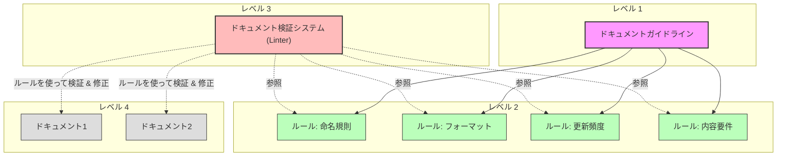
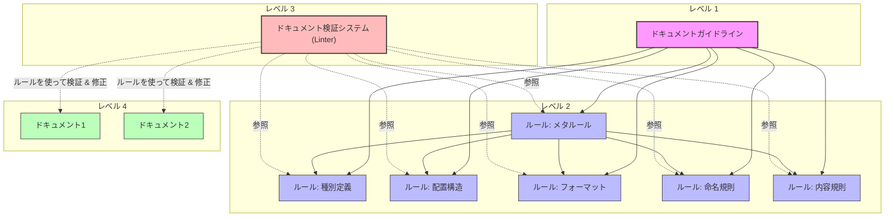

# Documentation System for People and LLMs to Work Together

## ドキュメント管理の概念モデル

このドキュメントシステムは、ESLintなどのリンティングツールに着想を得た概念モデルに基づき、高品質なドキュメントを確保するための3つの主要コンポーネントで構成されています。



### 主要コンポーネント

1. **ドキュメントガイドライン**（レベル1）
   - 目的、価値観、長期的ビジョンを定義
   - 「なぜ」「何のために」ドキュメントを管理するかを示す
   - 例：「人間とLLMの両方が理解できる形式で、最新の状態を維持し、必要な情報に素早くアクセスできるようにする」

2. **ドキュメントルール**（レベル2）
   - ガイドラインから導出された具体的で検証可能なルール
   - 命名規則、フォーマット、更新頻度などの基準
   - 例：「マークダウンファイルは、最上部に更新日時を記載し、目次を含める」

3. **ドキュメント検証システム (Linter)**（レベル3）
   - ルールの適用状況をチェックし、必要に応じて強制適用
   - LLMを活用した検証と自動修正
   - 例：「ドキュメントリンター」がコミット前にマークダウンファイルをチェックし、違反を報告または修正

### ソフトウェアエンジニアリング実践との関係

この概念モデルは、ソフトウェアエンジニアリングツールと実践に対応しています：

1. **ドキュメントガイドライン** ≈ アーキテクチャ原則・設計思想
2. **ドキュメントルール** ≈ コーディング規約・ESLintルール
3. **ドキュメント検証システム** ≈ ESLint（`--check`と`--fix`機能）

ESLintがルールと自動チェック/修正でコード品質を確保するように、ドキュメント検証システムは同様のメカニズムでドキュメント品質を確保し、LLMを活用してコンテキストを認識した検証を行います。

## 目的

人とLLMが効率的にプロジェクトを理解し協働するために、
- 必要なドキュメント（テキスト・画像資料）の種類を提案
- ドキュメントの効果的な作成・更新・管理のガイドラインとプロセスを提案

## 前提や背景

- 人もLLMもContextサイズに制約があるため、ドキュメントを適切に分割・整理し効率的にアクセスできるようにする必要がある
- LLMと人間の協働には、人間が理解できるドキュメント形式が必要

## 用語

- **AI**: CLINE やRoo Code などのAI、LLMツール
- **ドキュメント**: テキスト資料や画像資料。プログラムコードもドキュメントとみなす
- **ドキュメントガイドライン**: 目的、価値観、長期的ビジョンを定義するもの。各プロジェクトの目的や規模に応じて策定
- **ドキュメントルール**: 作成・更新・管理のための具体的で検証可能なルール。ガイドラインから導出される。一般的なルール：
  - ドキュメント種別に関するルール
  - 配置構造に関するルール
  - フォーマットに関するルール
  - 命名規則に関するルール
  - 内容に関するルール
  - メタ的なルール（ドキュメントルール自体のルール）



## 利用フロー

1. **ドキュメントガイドラインの策定**
   - ベストプラクティスの理解
   - プロジェクトの特性理解（規模に応じた必要ドキュメントの違いなど）
   - ガイドライン策定（構造、規約など）
   - 既存ガイドラインの改善検討

2. **現状とのギャップ分析**
   - 基本方針と現状の比較
   - ギャップの特定と分析

3. **適用計画の策定**
   - ギャップの優先順位付け
   - 段階的な適用計画の作成

4. **適用計画の実行**
   - 計画に基づく改善実施
   - 必要に応じた計画の見直し

5. **定期的な検査と更新**
   - ガイドラインの定期的な見直し
   - 目的や機能変化に応じた調整
   - 遵守状況の確認と修正

## ドキュメントガイドラインと各ドキュメントルールの推奨例

以下は推奨例です。プロジェクトの特性に応じて調整してください。
実際の運用では、各ルールやガイドラインを個別のファイルに分けて管理することを推奨します。

### ドキュメントガイドライン例
#### 配置場所
- docs/README.md

#### 具体例
```markdown
# ドキュメント基本方針
## 目的
- 人とLLMがドキュメントを作成・更新するためのガイドラインを策定する
- プロジェクトの持続的な発展と効率的な知識共有を実現する
- 異なるステークホルダーの必要性に応じたドキュメント構造を確立する
- LLM（Clineなど）の活用を含めた、ドキュメント作成・維持の効率化を実現する
- プロジェクトの知識資産としてのドキュメントの価値を最大化する

## ドキュメント体系の理想像
1. **網羅性**: プロジェクト全体の知識が適切に文書化され、必要な情報が容易に見つかる
2. **一貫性**: 標準化されたテンプレートとルールに基づいた、一貫性のある表現と構造
3. **保守性**: 更新が容易で、コードとドキュメントの乖離が最小限に抑えられる
4. **対象者別アクセス**: 各ステークホルダーが必要な情報に効率的にアクセスできる
5. **プロセス統合**: 開発プロセスと緊密に統合された、持続可能なドキュメンテーションフロー
6. **依存関係の透明性**: ドキュメント間の依存関係が明示され、変更の影響範囲が容易に把握できる

## ドキュメントガイドラインを実現するルールの一覧と概要
- [ドキュメント種別](docs/doc-types.md):
  - プロジェクトに必要なドキュメントの種別を定義する
  - ...
- [ドキュメント配置構造](docs/doc-structure.md):
  - ドキュメントの配置構造を定義する
  - ...
- [ドキュメントフォーマット](docs/doc-format.md):
  - ドキュメントのフォーマットを定義する
  - ...
- [ドキュメントの更新ルール](docs/doc-update-rules.md):
  - ドキュメントの更新ルールを定義する
  - ...
- [ドキュメント依存関係管理](docs/doc-dependencies.md):
  - ドキュメント間の依存関係を管理するルールを定義する
  - ...
- [ドキュメントメタデータ標準](docs/doc-metadata.md):
  - ドキュメントのメタデータ標準を定義する
  - ...
- [ドキュメント検証システム](docs/doc-validation.md):
  - ドキュメントの検証と自動修正の仕組みを定義する
  - ...
```
#### 注意事項
- ルートディレクトリのREADMEからリンクさせる
- サマリーとルールセクションを必ず含める

### ドキュメントルール例: ドキュメント種別の定義
#### 配置場所
- docs/doc-types.md

#### 具体例
```markdown
# ドキュメント種別
## 目的
- プロジェクトに必要なドキュメントの種別を定義する

## ドキュメント種別
### プロジェクト概要
- プロジェクトの目的や概要を説明するドキュメント
- 全プロジェクトメンバーが必ず知っておくべき情報

### ロードマップ一覧
- プロジェクトのロードマップを一覧化したドキュメント
- 開発予定の機能やリリース予定日などを記載
- 詳細は別ファイルへと分割

### ユーザガイド
- プロジェクトのユーザ向けのドキュメント
- ユーザがプロジェクトを利用するために必要な情報を記載

### ...
```

### ドキュメントルール例: ドキュメントの配置構造
#### 配置場所
- docs/doc-structure.md

#### 具体例
```markdown
# ドキュメントの配置構造
## 目的
- ドキュメントの配置構造を定義し、人とLLMがドキュメントを発見しやすくする
- 対象読者別のアクセスパスを最適化し、必要な情報への効率的なアクセスを実現する
- 時間軸（現在の機能と未来の機能）による分類を明確にする
- ルールとコンテンツを分離し、管理の一貫性を確保する

## 配置構造の基本原則
1. **対象者中心**: 主要な情報を開発者・運用者・エンドユーザーなど対象読者別に整理
2. **明確な責任分離**: 開発、運用、利用の各領域を明確に区分
3. **ルールとコンテンツの分離**: 規約と実際のコンテンツを分けて管理
4. **時間軸による分類**: 現在の機能と未来の機能を区別

## 理想のドキュメント構造
docs/
├── README.md                         # ドキュメントガイドライン
├── PLAN.md                           # ドキュメントルールの適用計画
├── PROGRESS.md                       # ドキュメントルールの適用状況
├── guide/                            # すべてのガイドのIndex
│   ├── README.md                     # ガイド全体の目次と導入
│   ├── developer/                    # 開発者向けガイド
│   │   ├── README.md                 # 開発者向けガイド目次
│   │   ├── getting-started/          # 開発環境構築等
│   │   ├── development-flow/         # 開発フロー関連
│   │   ├── packages/                 # モノレポ内のパッケージ概要
│   │   ├── architecture/             # アーキテクチャ関連
│   │   │   ├── adr/                  # アーキテクチャ決定記録
│   │   │   └── ...
│   │   └── ...
│   ├── operator/                     # 運用者向けガイド
│   │   ├── README.md
│   │   ├── deployment/               # デプロイメント関連
│   │   ├── monitoring/               # 監視関連
│   │   ├── maintenance/              # メンテナンス関連
│   │   └── ...
│   └── users/                        # ユーザー向けガイド
│       ├── README.md                 # ユーザー向けガイド目次
│       ├── basics/                   # 基本操作ガイド
│       ├── integration/              # 連携関連ガイド
│       └── ...
├── templates/                        # すべてのテンプレートを集約
│   ├── README.md                     # テンプレート全体の説明と使い方
│   ├── documents/                    # ドキュメント作成用テンプレート
│   ├── development/                  # 開発用テンプレート
│   └── operations/                   # 運用用テンプレート
├── rules/                            # ドキュメントルール
│   ├── README.md                     # ドキュメントルール一覧と概要
│   ├── ai/                           # AI関連ドキュメントルール
│   │   ├── README.md                 # AI関連ルールの概要
│   │   ├── config/                   # AIの設定ファイル確認
│   │   ├── minimum-change/           # 最小変更ルール
│   │   ├── ask/                      # 質問ルール
│   │   ├── commit/                   # コミットメッセージルール
│   │   ├── tools/                    # ツール活用ルール
│   │   ├── maintenance/              # ドキュメント更新ルール
│   │   └── preparation/              # AI利用準備ルール
│   ├── guide/
│   │   ├── developer/                # 開発者向けドキュメントルール
│   │   │   ├── code/                 # コードファイルルール
│   │   │   ├── package/              # パッケージREADMEルール
│   │   │   ├── architecture/         # アーキテクチャルール
│   │   │   └── development-flow/     # 開発フローのルール
│   │   ├── operator/                 # 運用者向けルール
│   │   └── users/                    # ユーザー向けルール
│   ├── documents/                    # ドキュメント全般ルール
│   │   ├── README.md                 # 概要
│   │   ├── maintenance/              # 更新ルール
│   │   └── metadata/                 # メタデータルール
│   │       ├── changelog/            # Changelogルール
│   │       ├── maintenance-date/     # メンテナンス日付ルール
│   │       ├── relations/            # 参照関係ルール
│   │       └── ...
│   └── product/                      # プロダクト関連ルール
└── product/                          # プロダクト情報
    ├── README.md                     # プロダクト概要
    ├── vision.md                     # ビジョン・ミッション
    ├── product-goal.md               # 製品目標
    ├── value-proposition.md          # 価値提案
    ├── members.md                    # 開発メンバー
    ├── features/                     # リリース済み機能
    │   ├── README.md                 # 機能一覧と概要
    │   └── [機能名]/                 # 個別機能ディレクトリ
    │       ├── overview.md           # 機能概要（ユーザー向け）
    │       ├── technical-details.md  # 技術詳細（開発者向け）
    │       └── specs.md        # 仕様（docs/guide/users/配下から間接的に参照されうる、内部仕様を含めた詳細な機能解説）
    ├── glossary/                     # 用語集
    │   ├── README.md                 # 用語集の概要
    │   └── terms/                    # 各用語の詳細
    │       └── [用語名].md           # 個別用語の定義
    ├── personas/                     # ユーザーペルソナ
    │   └── README.md                 # ペルソナ一覧と詳細
    ├── user-journey/                 # ユーザージャーニー
    │   └── README.md                 # 主要ジャーニーの図解
    ├── metrics/                      # 製品メトリクス
    │    └── README.md                # KPI・OKR等の指標
    └── roadmaps/                     # 未来の機能計画
        ├── README.md                 # ロードマップ概要
        └── [予定機能名]/             # 予定機能の詳細計画
            ├── README.md             # 概要とドキュメント構造
            ├── requirements/         # 非エンジニア向け
            │   ├── README.md         # 要件ドキュメントガイド
            │   ├── PRD.md            # 製品要件定義書
            │   └── images/           # 図表・モックアップ
            └── systems/              # エンジニア向け
                ├── README.md         # システムドキュメントガイド
                ├── overview-specs/   # システム全体設計
                │   ├── README.md     # 全体設計概要
                │   └── system.md     # システム全体設計書
                ├── package-specs/    # パッケージ仕様書
                │   ├── README.md     # パッケージ仕様概要
                │   ├── [パッケージ名]/ # 各パッケージ仕様
                │   └── ...
                └── test-specs/       # テスト仕様書
                    ├── README.md     # テスト戦略概要
                    ├── e2e-tests.md  # E2Eテスト仕様
                    └── unit-tests.md # ユニットテスト仕様
```

#### 注意事項
- ルートディレクトリのREADMEからリンクさせる
- .clinerules.md などLLM向けファイルにもリンクを貼る

### ドキュメントルール例: ドキュメントルールの適用状況
#### 配置場所
- docs/PROGRESS.md
#### 具体例
```markdown
# ドキュメントルールの適用状況
## 目的
- ドキュメントルールの適用状況を人とLLMが把握しやすくする

## 適用状況
### メタデータへのチェンジログ記載
- ルールの場所: rules/documents/metadata/changelog/
- 最終検査日: 2023/10/01
- 適用割合: 20%
- 適用状態の概要:
  - xxx/yyy/配下は全適用済み (2023/10/01)
- 課題: 
  - チェンジログの記載漏れが多い
  - チェンジログの記載内容が不十分
```

### ドキュメントルール例: 開発フローの定義
#### 配置場所
- docs/guide/developer/development-flow/README.md

#### 具体例
```markdown
# 開発フロー
## 目的  
- 開発フローを定義し、開発者とLLMが効率的に開発を行えるようにする

## 開発フローの概要
1. **要件定義**: Product Requirement Documentを作成しレビュー
2. **技術検討**: Technical Design Documentを作成しレビュー
3. **実装**: Technical Design Documentをもとに実装、コードレビュー
4. **テスト**: Technical Design Documentをもとにテスト実施
5. **リリース**: Technical Design Documentをもとにリリース実施
6. **振り返り**: 開発フローの改善等を実施
7. **評価**: 顧客の反応をもとに将来の機能開発の参考にする
```

### ドキュメントルール例: AIのRepomixの活用
#### 配置場所
- docs/rules/ai/tools/repomix/README.md

#### 具体例
```markdown
# AIのRepomixの活用
## 目的
- AIがRepomixを効果的に活用するためのルールを定義

## Repomixの効果的な活用ルール
- **効率的な理解**: MCPを利用して大規模コードベースを効率的に理解
- **パッケージ分析**: 特定パッケージの調査には、repomixによる分析を推奨
- **通信負荷軽減**: 数十ファイル以上のパッケージでは、関数シグネチャのみを分析し時間短縮
- **柔軟な利用**: リポジトリ全体、特定パッケージ、特定ディレクトリなど様々な階層で利用可能
- **設定確認**: MCPが未設定の場合は、ユーザにセットアップを促す
```

### ドキュメントルール例: AIのコミットルール
#### 配置場所
- docs/rules/ai/commit/README.md

#### 具体例
```markdown
# AIのコミットルール
## 目的
- AIが適切にコミットの提案とメッセージを記録するためのルールを定義

## コミットルール
**必ず遵守すべきポイント**:
✅ **積極的な提案**: 作業完了時には必ずコミットを提案
✅ **標準形式の遵守**: 「種類: 要約」の形式で、詳細な説明と変更ファイル一覧を含める
✅ **プロンプト履歴の記録**: プロンプト履歴をコミットメッセージに含める
✅ **ユーザー承認**: コミット提案時にはユーザーの承認を得る
```

### ドキュメントルール例: AIの設定ファイルルール
#### 配置場所
- docs/rules/ai/config/README.md

#### 具体例
```markdown
# AIの設定ファイルルール
## 目的
- AIのセットアップが適切に行われていることを確認

## 設定ファイルの確認
- Clineを使用する場合は、設定ファイルの存在と内容を確認
- Roo Codeを使用する場合は、設定ファイルの存在と内容を確認
```

### ドキュメントルール例: ドキュメント依存関係管理
#### 配置場所
- docs/rules/documents/relations/README.md

#### 具体例
```markdown
# ドキュメント依存関係管理
## 目的
- 依存関係を明示的に管理し、変更時の影響範囲を把握しやすくする
- 知識の整合性を維持し、更新の一貫性を確保する
- 知識ネットワークを可視化し、関連情報へのアクセスを容易にする

## 依存関係メタデータの標準形式
各ドキュメントの末尾に「ドキュメント関係」セクションを追加：

```markdown
## ドキュメント関係

### 参照ドキュメント
- [API仕様書](../specs/api/README.md) - API構造の直接参照
- [データモデル設計](../specs/data-models.md) - ユーザーモデルの概念参照

### 被参照ドキュメント
- [ユーザー認証ガイド](../guide/users/authentication.md) - 認証フローの派生関係
- [開発環境構築ガイド](../guide/developer/getting-started.md) - APIエンドポイントの概念参照

### 関連キーワード
#ユーザー認証 #API #セキュリティ #OAuth
```

## 依存関係の種類
- **直接参照**: 内容を直接引用・参照している関係
- **概念参照**: 定義された概念や用語を使用している関係
- **派生関係**: 別のドキュメントから派生・詳細化されている関係

## 依存関係管理のベストプラクティス
- 更新時には、依存関係メタデータを参照して影響範囲を確認
- 双方向の参照関係を一致させる（参照と被参照の整合性を維持）
- 依存関係の種類を明示し、変更時の影響度を判断しやすくする
- 定期的に整合性を検証し、孤立したドキュメントや循環参照を特定・修正

### ドキュメントルール例: ドキュメントメタデータ標準
#### 配置場所
- docs/rules/documents/metadata/README.md

#### 具体例
```markdown
# ドキュメントメタデータ標準
## 目的
- 属性情報を標準化し、管理と検索を容易にする
- ライフサイクル管理を支援する
- 対象読者や技術レベルを明示し、適切な情報へのアクセスを促進する

## 標準メタデータセクション
すべてのドキュメントに以下のメタデータセクションを含める：

```markdown
## メタデータ

**更新・確認情報**:
- 最終更新日: YYYY/MM/DD
- 最終確認日: YYYY/MM/DD

**文書情報**:
- ステータス: 草案 | レビュー中 | 承認済み | 公開 | 廃止予定 | アーカイブ
- バージョン: 1.0.0
```

## メタデータフィールドの説明
### ステータス: ドキュメントの現在の状態
- **草案**: 初期作成中または大幅な改訂中
- **レビュー中**: レビュープロセス進行中
- **承認済み**: レビュー完了、正式版として承認済み
- **公開**: 外部公開可能な状態
- **廃止予定**: 将来的に廃止予定の情報
- **アーカイブ**: 歴史的参照のために保持

## メタデータ管理のベストプラクティス
- 必須メタデータフィールドを漏れなく記入する
- 日付は YYYY/MM/DD 形式で統一
- バージョン番号はセマンティックバージョニングに準拠
- 大きな変更がなくても、定期的に最終確認日を更新

### ドキュメントルール例: ナビゲーション構造の強化
#### 配置場所
- docs/rules/documents/navigation/README.md

#### 具体例
```markdown
# ナビゲーション構造の強化
## 目的
- ドキュメント間の移動を容易にし、必要な情報への効率的なアクセスを実現
- 階層構造と関連性を明示し、コンテキストを維持しながらの探索を可能に
- 異なるステークホルダーが関連情報に素早くアクセスできるようにする

## ナビゲーション要素

### 1. ドキュメントポータル
`docs/README.md`をプロジェクト全体のドキュメントへの体系的なガイドとして整備：

# プロジェクト ドキュメントポータル

## 対象読者別エントリーポイント
- [開発者向けガイド](./guide/developer/README.md) - 開発環境構築、API仕様、実装ガイドライン
- [運用担当者向けガイド](./guide/operator/README.md) - デプロイメント、監視、メンテナンス
- [エンドユーザー向けガイド](./guide/users/README.md) - 基本操作、機能説明、トラブルシューティング

## はじめに読むべきドキュメント
- [プロジェクト概要](./product/README.md) - プロジェクトの目的と主要機能
- [アーキテクチャ概要](./guide/developer/architecture/overview/README.md) - システム全体の設計思想
- [開発環境構築](./guide/developer/getting-started/setup.md) - 開発を始めるための準備

## 主要カテゴリ
- [製品情報](./product/README.md) - ビジョン、機能一覧、ロードマップ
- [開発ガイド](./guide/developer/README.md) - 開発者向けの技術情報
- [運用ガイド](./guide/operator/README.md) - システム運用に関する情報
- [ユーザーガイド](./guide/users/README.md) - エンドユーザー向けの使用方法
- [ルール集](./rules/README.md) - プロジェクトの各種規約とガイドライン

### 2. ブレッドクラム
各ドキュメントの冒頭に階層構造を示すブレッドクラムを追加：

**パス**: [ドキュメントポータル](../../README.md) > [開発者ガイド](../README.md) > [アーキテクチャ](./README.md)

### 3. 関連ドキュメントセクション
各ドキュメントの末尾に関連する他のドキュメントへのリンクを一覧で追加：

```markdown
## 関連ドキュメント
- [API仕様書](../../reference/api/README.md) - 関連APIの詳細仕様
- [データモデル](../architecture/data-models.md) - 関連するデータモデルの説明
- [実装ガイドライン](../implementation/guidelines.md) - 実装時の注意点
```

### 4. インデックスページ
各ディレクトリには必ずREADME.mdを配置し、そのディレクトリ内のコンテンツの概要と目次を提供：

```markdown
# 開発者ガイド

## 概要
このディレクトリには、開発者向けの技術情報が含まれています。

## コンテンツ
- [開発環境構築](./getting-started/README.md) - 開発を始めるための準備
- [アーキテクチャ](./architecture/README.md) - システム設計に関する情報
- [API仕様](./api/README.md) - APIの詳細仕様
- [実装ガイドライン](./implementation/README.md) - コーディング規約と実装例
```

## ナビゲーション構造のベストプラクティス
- 相対パスを一貫して使用し、リポジトリの移動や再構成に強い参照を維持
- 階層は3〜4レベルを超えないようにし、深すぎる階層構造を避ける
- 関連ドキュメントは、単なるリンクではなく、関連性の説明を含める
- 対象読者別のエントリーポイントを明確に提供し、ユーザージャーニーを考慮したナビゲーションを設計


### ドキュメントルール例: ドキュメント検証システム
#### 配置場所
- docs/rules/documents/validation/README.md

#### 具体例
```markdown
# ドキュメント検証システム
## 目的
- 品質と一貫性を自動的に検証し、問題を早期に発見
- メタデータやフォーマットの標準への準拠を確保
- ドキュメント間の参照整合性を維持

## @docコマンド体系
LLMを活用したドキュメント検証と管理のためのコマンド体系：

### 主要コマンド一覧
| コマンド               | 説明                                   | 主な用途                   |
| ---------------------- | -------------------------------------- | -------------------------- |
| `analyze-dependencies` | 依存関係を分析・視覚化                 | 影響範囲分析、構造理解     |
| `update-references`    | 参照関係を更新                         | 一貫性維持、双方向参照更新 |
| `validate-metadata`    | メタデータの検証と問題報告             | 品質保証、標準適合確認     |
| `update-metadata`      | メタデータフィールドの更新             | メンテナンス、一括更新     |
| `migrate-document`     | ドキュメントの移行支援                 | 構造再編成、最適配置       |
| `find-orphans`         | 孤立したドキュメントの検出             | 品質保証、カバレッジ向上   |
| `generate-index`       | 索引・目次の自動生成                   | ナビゲーション改善         |
| `help`                 | ヘルプ情報の表示                       | 使用方法の理解             |

### コマンド使用例

#### 依存関係の分析
```
@doc analyze-dependencies docs/guide/developer/ --depth=2 --format=mermaid
```

#### メタデータの検証
```
@doc validate-metadata docs/product/features/ --fix --level=warning
```

#### 孤立ドキュメントの検出
```
@doc find-orphans docs/ --type=both --exclude="README.md$"
```

#### 索引の生成
```
@doc generate-index docs/guide/developer/ --type=toc --output=docs/guide/developer/index.md
```

## 検証項目
- **メタデータの完全性**: 必須メタデータフィールドの存在確認
- **フォーマットの一貫性**: 日付形式、バージョン番号形式、ステータス値の検証
- **リンクの有効性**: 内部リンクと外部リンクの検証
- **参照の整合性**: 双方向参照（参照と被参照）の一致確認
- **構造の一貫性**: ディレクトリ構造とファイル命名規則の遵守確認

## 検証プロセスの統合
- コミット前の自動検証を設定し、問題を早期に発見
- CI/CDパイプラインにドキュメント検証ステップを組み込み
- 定期的な一括検証を実施し、全体的な品質を監視
- 検証結果をレポートとして生成し、改善点を可視化
```

### ドキュメントルール例: 進捗管理と実装計画
#### 配置場所
- docs/rules/documents/implementation/README.md

#### 具体例
```markdown
# ドキュメント改善の進捗管理と実装計画
## 目的
- 改善活動の進捗を可視化し、ステークホルダーに透明性を提供
- 段階的な実装計画を策定し、優先順位に基づいた効率的な改善を実現
- 改善活動の成果を測定し、継続的な改善サイクルを確立

## 進捗レポートの標準形式
\```markdown
# ドキュメント改善 進捗レポート

## 更新・確認情報
- 最終更新日: YYYY/MM/DD
- 最終確認日: YYYY/MM/DD

## プロジェクト全体の進捗状況
| 指標                          | 状況     |
| ----------------------------- | -------- |
| 全体進捗率                    | XX%      |
| フェーズ1（基盤整備）         | 完了     |
| フェーズ2（主要ドキュメント） | XX% 完了 |
| フェーズ3（拡張・最適化）     | 未着手   |

## 最近の主な成果
- [YYYY/MM/DD] メタデータ標準の策定と適用開始
- [YYYY/MM/DD] 開発者ガイドの全面改訂完了
- [YYYY/MM/DD] 検証システムのプロトタイプ実装

## 現在の課題と対応状況
| 課題                           | 優先度 | 状況     | 対応予定日 |
| ------------------------------ | ------ | -------- | ---------- |
| メタデータの不整合が多数存在   | 高     | 対応中   | YYYY/MM/DD |
| 古いドキュメント形式の残存     | 中     | 計画済み | YYYY/MM/DD |
| ドキュメント間の参照整合性不足 | 高     | 対応中   | YYYY/MM/DD |

## 次のステップ
1. メタデータ検証の自動化完了 (YYYY/MM/DD まで)
2. 運用ガイドの全面改訂 (YYYY/MM/DD まで)
3. 依存関係の可視化ツール導入 (YYYY/MM/DD まで)
\```

## 実装計画の策定

### フェーズ分け
ドキュメント改善を以下のフェーズに分けて段階的に実施：

## 実装フェーズ

### フェーズ1: 基盤整備 (YYYY/MM/DD - YYYY/MM/DD)
- [ ] ガイドラインの策定
- [ ] 構造の定義
- [ ] メタデータ標準の策定
- [ ] テンプレートの作成
- [ ] 基本的な検証ルールの定義

### フェーズ2: 主要ドキュメントの整備 (YYYY/MM/DD - YYYY/MM/DD)
- [ ] 開発者ガイドの改訂
- [ ] 運用ガイドの改訂
- [ ] ユーザーガイドの改訂
- [ ] プロダクト情報の整備
- [ ] 依存関係メタデータの追加

### フェーズ3: 拡張と最適化 (YYYY/MM/DD - YYYY/MM/DD)
- [ ] 検証システムの完全実装
- [ ] CI/CDパイプラインへの統合
- [ ] ナビゲーション構造の最適化
- [ ] 検索機能の強化
- [ ] フィードバックループの確立

## 優先順位付けの基準
1. **影響範囲**: より多くのステークホルダーに影響するドキュメントを優先
2. **更新頻度**: 頻繁に参照・更新されるドキュメントを優先
3. **技術的依存**: 他のドキュメントから多く参照されるドキュメントを優先
4. **実装容易性**: 短期間で大きな改善が見込める項目を初期に実施

## リソース計画
- ドキュメント専任担当: XX人日/月
- 開発者の貢献: XX人日/月
- 外部レビュアー: XX人日/月
- ツール開発・導入: XX人日（初期）+ XX人日/月（運用）
```

## 進捗管理のベストプラクティス
- 定期的（週次または月次）に進捗レポートを更新し、状況を可視化
- 実装計画は四半期ごとに見直し、必要に応じて優先順位や期間を調整
- 小さな成功を積み重ねるアプローチを採用し、早期に価値を提供
- 定量的指標（カバレッジ率、準拠率など）と定性的指標（ユーザーフィードバック）の両方を活用
- 改善活動自体を継続的に改善し、より効率的なプロセスを確立

# Changelog

## 2025/03/23
- [追加] ドキュメント管理の概念モデルを追加（ガイドライン、ルール、検証システム）
- [変更] 用語を統一（ドキュメンテーションガイドライン→ドキュメントガイドライン）
- [追加] ESLintに着想を得た検証システム（Linter）の概念を導入
- [改善] 概念モデルを階層的なレイアウト（レベル1〜4）で表現し、関係性を明確化

## 2025/03/21
- [追加] 初版作成