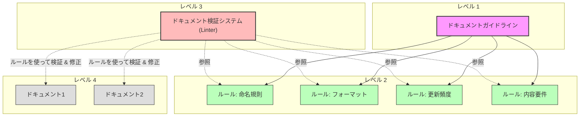
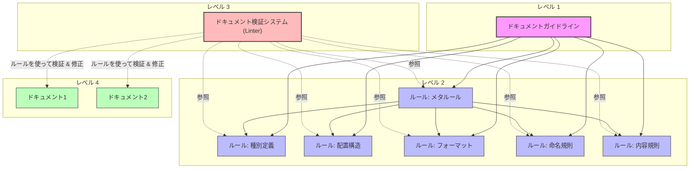

# Documentation System for People and LLMs to Work Together

## ドキュメント管理の概念モデル

このドキュメントシステムは、ソフトウェアエンジニアリングの実践（特にESLintなどのリンティングツール）に着想を得た簡略化された概念モデルに基づいています。このモデルは、高品質なドキュメントを確保するために連携する3つの主要コンポーネントで構成されています。



### 主要コンポーネント

1. **ドキュメントガイドライン**（レベル1）
   - ドキュメント管理の根本的な目的、価値観、長期的ビジョンを定義
   - 「なぜ」「何のために」ドキュメントを管理するのかを示す
   - 例：「すべてのドキュメントは、人間とLLMの両方が理解できる形式で、最新の状態を維持し、必要な情報に素早くアクセスできるようにする」

2. **ドキュメントルール**（レベル2）
   - ガイドラインから導出された具体的で検証可能な個別ルール
   - 命名規則、フォーマット、更新頻度などの明確な基準
   - 例：「すべてのマークダウンファイルは、最上部に更新日時を記載し、目次を含める」

3. **ドキュメント検証システム (Linter)**（レベル3）
   - ルールの適用状況をチェックし、必要に応じて強制適用する仕組み
   - LLMを活用したインテリジェントな検証と自動修正
   - 例：「ドキュメントリンター」がコミット前にすべてのマークダウンファイルをチェックし、ルール違反を報告または自動修正

### ソフトウェアエンジニアリング実践との関係

この概念モデルは、一般的なソフトウェアエンジニアリングツールと実践に対応しています：

1. **ドキュメントガイドライン** ≈ アーキテクチャ原則・設計思想
2. **ドキュメントルール** ≈ コーディング規約・ESLintルール
3. **ドキュメント検証システム** ≈ ESLint（`--check`と`--fix`機能）

ESLintが定義されたルールと自動チェック/修正を通じてコード品質を強制するのと同様に、ドキュメント検証システムは同様のメカニズムを通じてドキュメント品質を確保し、より知的でコンテキストを認識した検証のためにLLMを活用します。

## 目的

人とLLMの両方が効率的にプロジェクトを理解し協働するために、
- 必要なドキュメント（テキスト・画像資料）の種類を提案する
- ドキュメントの効果的な作成・更新・管理のためのガイドラインとプロセスを提案する

## 前提や背景

- 人もLLMもContextサイズの制約があるため、ドキュメントを適切に分割・整理し効率的にアクセスできるようにする必要がある
- LLMと人間が協働する場合、人間が理解できるドキュメント形式が必要である

## 用語

- **AI**: CLINE やRoo Code などのAI、LLMツールを指す
- **ドキュメント**: テキスト資料や画像資料。プログラムコードもドキュメントとみなす
- **ドキュメントガイドライン**: ドキュメント管理の根本的な目的、価値観、長期的ビジョンを定義するもの。各プロジェクトの目的や規模に応じて独自に策定する
- **ドキュメントルール**: ドキュメント作成・更新・管理のための具体的で検証可能な個別ルール。ドキュメントガイドラインから導出される。一般的に適用可能なルールとして以下がある：
  - ドキュメント種別に関するルール
  - ドキュメント配置構造に関するルール
  - フォーマットに関するルール
  - 命名規則に関するルール
  - 内容に関するルール
  - メタ的なドキュメントルール（ドキュメントルール自体のルール）



## 利用フロー

1. **ドキュメンテーションガイドラインの策定**
   - ベストプラクティクスの理解
   - 自プロジェクトの特性理解（規模に応じた必要ドキュメントの違いなど）
   - ガイドライン策定（ドキュメント構造、ディレクトリ構造、各種規約など）
   - 既存ガイドラインの改善検討

2. **現状とのギャップ分析**
   - 策定した基本方針と現状の比較
   - ギャップの特定と分析

3. **適用計画の策定**
   - 分析したギャップの優先順位付け
   - 段階的な適用計画の作成（適用しやすいルールから実施など）

4. **適用計画の実行**
   - 計画に基づく改善実施
   - 現状との乖離がある場合は計画の見直し

5. **定期的な検査と更新**
   - ガイドラインの定期的な見直し
   - プロダクトの目的や機能変化に応じた調整
   - ガイドラインと各ルールの遵守状況の確認と修正

## ドキュメンテーションガイドラインと各ドキュメントルールの推奨例

以下に推奨例を示します。これらはあくまで一例であり、プロジェクトの特性に応じて調整してください。  
実際の運用では、各ドキュメントルールやガイドラインを個別のファイルに分けて管理することを推奨します。

### ドキュメントガイドライン例
#### 配置場所
- docs/README.md

#### 具体例
```markdown
# ドキュメント基本方針
## 目的
- 人とLLMがドキュメントを作成・更新するためのガイドラインを策定する
- ...

## ドキュメントガイドラインを実現するルールの一覧と概要
- [ドキュメント種別](docs/doc-types.md): 
  - プロジェクトに必要なドキュメントの種別を定義する
  - ...
- [ドキュメント配置構造](docs/doc-structure.md): 
  - ドキュメントの配置構造を定義する
  - ...
- [ドキュメントフォーマット](docs/doc-format.md): 
  - ドキュメントのフォーマットを定義する
  - ...
- [ドキュメントの更新ルール](docs/doc-update-rules.md): 
  - ドキュメントの更新ルールを定義する
  - ...
```
#### 注意事項
- プロジェクトのルートディレクトリのREADMEからリンクさせる
- サマリーセクションとドキュメントルールセクションを必ず含める

### ドキュメントルール例: ドキュメント種別の定義
#### 配置場所
- docs/doc-types.md

#### 具体例
```markdown
# ドキュメント種別
## 目的
- プロジェクトに必要なドキュメントの種別を定義する

## ドキュメント種別
### プロジェクト概要
- プロジェクトの目的や概要を説明するドキュメント
- 全プロジェクトメンバーが必ず知っておくべき情報

### ロードマップ一覧
- プロジェクトのロードマップを一覧化したドキュメント
- 開発予定の機能やリリース予定日などを記載
- 詳細は別ファイルへと分割

### ユーザガイド
- プロジェクトのユーザ向けのドキュメント
- ユーザがプロジェクトを利用するために必要な情報を記載

### ...
```

### ドキュメントルール例: ドキュメントの配置構造
#### 配置場所
- docs/doc-structure.md

#### 具体例
```markdown
# ドキュメントの配置構造
## 目的
- ドキュメントの配置構造を定義し、人とLLMがドキュメントを発見しやすくする

## 理想のドキュメント構造
docs/
├── README.md                         # ドキュメントガイドライン
├── PLAN.md                           # ドキュメントルールの適用計画
├── PROGRESS.md                       # ドキュメントルールの適用状況
├── guide/                            # すべてのガイドのIndex
│   ├── README.md                     # ガイド全体の目次と導入
│   ├── developer/                    # 開発者向けガイド
│   │   ├── README.md                 # 開発者向けガイド目次
│   │   ├── getting-started/          # 開発環境構築等
│   │   ├── development-flow/         # 開発フロー関連
│   │   ├── packages/                 # モノレポ内のパッケージ概要
│   │   ├── architecture/             # アーキテクチャ関連
│   │   │   ├── adr/                  # アーキテクチャ決定記録
│   │   │   └── ...
│   │   └── ...
│   ├── operator/                     # 運用者向けガイド
│   │   ├── README.md
│   │   ├── deployment/               # デプロイメント関連
│   │   ├── monitoring/               # 監視関連
│   │   ├── maintenance/              # メンテナンス関連
│   │   └── ...
│   └── users/                        # ユーザー向けガイド
│       ├── README.md                 # ユーザー向けガイド目次
│       ├── basics/                   # 基本操作ガイド
│       ├── integration/              # 連携関連ガイド
│       └── ...
├── rules/                            # ドキュメントルール
│   ├── README.md                     # ドキュメントルール一覧と概要
│   ├── ai/                           # AI関連ドキュメントルール
│   │   ├── README.md                 # AI関連ルールの概要
│   │   ├── config/                   # AIの設定ファイル確認
│   │   ├── minimum-change/           # 最小変更ルール
│   │   ├── ask/                      # 質問ルール
│   │   ├── commit/                   # コミットメッセージルール
│   │   ├── tools/                    # ツール活用ルール
│   │   ├── maintenance/              # ドキュメント更新ルール
│   │   └── preparation/              # AI利用準備ルール
│   ├── guide/                  
│   │   ├── developer/                # 開発者向けドキュメントルール
│   │   │   ├── code/                 # コードファイルルール
│   │   │   ├── package/              # パッケージREADMEルール
│   │   │   ├── architecture/         # アーキテクチャルール
│   │   │   └── development-flow/     # 開発フローのルール
│   │   ├── operator/                 # 運用者向けルール
│   │   └── users/                    # ユーザー向けルール
│   ├── documents/                    # ドキュメント全般ルール
│   │   ├── README.md                 # 概要
│   │   ├── maintenance/              # 更新ルール
│   │   └── metadata/                 # メタデータルール
│   │       ├── changelog/            # Changelogルール
│   │       ├── maintenance-date/     # メンテナンス日付ルール
│   │       ├── relations/            # 参照関係ルール
│   │       └── ...
│   └── product/                      # プロダクト関連ルール
└── product/                          # プロダクト情報
    ├── README.md                     # プロダクト概要
    ├── vision.md                     # ビジョン・ミッション
    ├── product-goal.md               # 製品目標
    ├── value-proposition.md          # 価値提案
    ├── members.md                    # 開発メンバー
    ├── features/                     # リリース済み機能
    │   ├── README.md                 # 機能一覧と概要
    │   └── [機能名]/                 # 個別機能ディレクトリ
    ├── glossary/                     # 用語集 
    │   ├── README.md                 # 用語集の概要
    │   └── terms/                    # 各用語の詳細
    │       └── [用語名].md           # 個別用語の定義
    ├── personas/                     # ユーザーペルソナ
    │   └── README.md                 # ペルソナ一覧と詳細
    ├── user-journey/                 # ユーザージャーニー
    │   └── README.md                 # 主要ジャーニーの図解
    ├── metrics/                      # 製品メトリクス
    │    └── README.md                # KPI・OKR等の指標
    └── roadmaps/                     # 未来の機能計画
        ├── README.md                 # ロードマップ概要
        └── [予定機能名]/             # 予定機能の詳細計画
            ├── README.md             # 概要とドキュメント構造
            ├── requirements/         # 非エンジニア向け
            │   ├── README.md         # 要件ドキュメントガイド
            │   ├── PRD.md            # 製品要件定義書
            │   └── images/           # 図表・モックアップ
            └── systems/              # エンジニア向け
                ├── README.md         # システムドキュメントガイド
                ├── overview-specs/   # システム全体設計
                │   ├── README.md     # 全体設計概要
                │   └── system.md     # システム全体設計書
                ├── package-specs/    # パッケージ仕様書
                │   ├── README.md     # パッケージ仕様概要
                │   ├── [パッケージ名]/ # 各パッケージ仕様
                │   └── ...
                └── test-specs/       # テスト仕様書
                    ├── README.md     # テスト戦略概要
                    ├── e2e-tests.md  # E2Eテスト仕様
                    └── unit-tests.md # ユニットテスト仕様
```

#### 注意事項
- プロジェクトのルートディレクトリのREADMEからリンクさせる
- .clinerules.md などLLM向けファイルにもリンクを貼る

### ドキュメントルール例: ドキュメントルールの適用状況
#### 配置場所
- docs/PROGRESS.md
#### 具体例
```markdown
# ドキュメントルールの適用状況
## 目的
- ドキュメントルールの適用状況を人とLLMが把握しやすくする

## 適用状況
### メタデータへのチェンジログ記載
- ルールの場所: rules/documents/metadata/changelog/
- 最終検査日: 2023/10/01
- 適用割合: 20%
- 適用状態の概要:
  - xxx/yyy/配下は全適用済み (2023/10/01)
- 課題: 
  - チェンジログの記載漏れが多い
  - チェンジログの記載内容が不十分
```

### ドキュメントルール例: 開発フローの定義
#### 配置場所
- docs/guide/developer/development-flow/README.md

#### 具体例
```markdown
# 開発フロー
## 目的  
- 開発フローを定義し、開発者とLLMが効率的に開発を行えるようにする

## 開発フローの概要
1. **要件定義**: Product Requirement Documentを作成しレビュー
2. **技術検討**: Technical Design Documentを作成しレビュー
3. **実装**: Technical Design Documentをもとに実装、コードレビュー
4. **テスト**: Technical Design Documentをもとにテスト実施
5. **リリース**: Technical Design Documentをもとにリリース実施
6. **振り返り**: 開発フローの改善等を実施
7. **評価**: 顧客の反応をもとに将来の機能開発の参考にする
```

### ドキュメントルール例: AIのRepomixの活用
#### 配置場所
- docs/rules/ai/tools/repomix/README.md

#### 具体例
```markdown
# AIのRepomixの活用
## 目的  
- AIがRepomixを効果的に活用するためのルールを定義する

## Repomixの効果的な活用ルール
- **効率的な理解**: repomixのMCPを利用して大規模コードベースを効率的に理解する
- **パッケージ分析**: 特定パッケージの調査には、repomixによる分析が強く推奨される
- **通信負荷軽減**: 数十ファイル以上のパッケージでは、Repomixを活用して関数シグネチャのみを効果的に分析し、時間短縮
- **柔軟な利用**: リポジトリ全体、特定パッケージ、特定ディレクトリなど様々な階層で利用可能
- **設定確認**: repomixのMCPが未設定の場合は、ユーザにセットアップを促す
```

### ドキュメントルール例: AIのコミットルール
#### 配置場所
- docs/rules/ai/commit/README.md

#### 具体例
```markdown
# AIのコミットルール
## 目的  
- AIが適切にコミットの提案とメッセージを記録するためのルールを定義する

## コミットルール
**必ず遵守すべき主要ポイント**: 
✅ **積極的な提案**: 作業完了時には必ずコミットを提案すること
✅ **標準形式の遵守**: 「種類: 要約」の形式で、詳細な説明と変更ファイル一覧を含めること
✅ **プロンプト履歴の記録**: プロンプト履歴を必ずコミットメッセージに含めること
✅ **ユーザー承認**: コミット提案時にはユーザーの承認を得ること
```

### ドキュメントルール例: AIの設定ファイルルール
#### 配置場所
- docs/rules/ai/config/README.md

#### 具体例
```markdown
# AIの設定ファイルルール
## 目的  
- AIのセットアップが適切に行われていることを確認する

## 設定ファイルの確認
- Clineを使用する場合は、Clineの設定ファイルの存在と内容を確認する
- Roo Codeを使用する場合は、Roo Codeの設定ファイルの存在と内容を確認する
```

# Changelog

## 2025/03/23
- [追加] ドキュメント管理の概念モデルを追加（ドキュメントガイドライン、ドキュメントルール、ドキュメント検証システム）
- [変更] 用語を統一（ドキュメンテーションガイドライン→ドキュメントガイドライン）
- [追加] ESLintに着想を得たドキュメント検証システム（Linter）の概念を導入
- [改善] 概念モデルを階層的なレイアウト（レベル1〜4）で表現し、関係性をより明確化

## 2025/03/21
- [追加] 初版作成