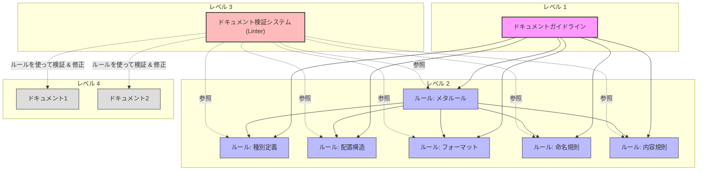

# Documentation System for People and LLMs to Work Together

## ドキュメント管理の概念モデル

このドキュメントシステムは、ESLintなどのリンティングツールに着想を得た概念モデルに基づく3つの主要コンポーネントで構成され、高品質なドキュメントを確保します。



### 主要コンポーネント

1. **ドキュメントガイドライン**（レベル1）
   - 目的、価値観、長期的ビジョンを定義
   - 「なぜ」「何のために」ドキュメントを管理するかを示す
   - 例：「人間とLLMが理解できる形式で最新の状態を維持し、必要情報に素早くアクセスできるようにする」

2. **ドキュメントルール**（レベル2）
   - ガイドラインから導出された具体的で検証可能なルール
   - 種別定義、配置構造、フォーマット、命名規則、内容規則などの基準
   - **メタルール**: 他のルールを管理・制御するルール
   - 例：「マークダウンファイルは最上部に更新日時を記載し、目次を含める」

3. **ドキュメント検証システム (Linter)**（レベル3）
   - ルールの適用状況をチェックし、必要に応じて強制適用
   - LLMを活用した検証と自動修正
   - 例：「ドキュメントリンター」がコミット前にマークダウンファイルをチェックし違反を報告または修正

### ソフトウェアエンジニアリング実践との関係

この概念モデルは、ソフトウェアエンジニアリングツールと実践に対応します：

1. **ドキュメントガイドライン** ≈ アーキテクチャ原則・設計思想
2. **ドキュメントルール** ≈ コーディング規約・ESLintルール
3. **ドキュメント検証システム** ≈ ESLint（`--check`と`--fix`機能）

ESLintがルールと自動チェック/修正でコード品質を確保するように、ドキュメント検証システムは同様のメカニズムでドキュメント品質を確保し、LLMを活用したコンテキスト認識検証を行います。

## 目的

人とLLMが効率的にプロジェクトを理解し協働するために：
- 必要なドキュメント（テキスト・画像資料）の種類を提案
- ドキュメントの効果的な作成・更新・管理のガイドラインとプロセスを提案

## 前提や背景

- 人もLLMもContextサイズに制約があるため、ドキュメントを適切に分割・整理し効率的にアクセスできるようにする必要がある
- LLMと人間の協働には、双方が理解できるドキュメント形式が必要

## 用語

- **AI**: CLINE やRoo Code などのAI、LLMツール
- **ドキュメント**: テキスト資料や画像資料。プログラムコードもドキュメントとみなす
- **ドキュメントガイドライン**: 目的、価値観、長期的ビジョンを定義するもの。プロジェクトの目的や規模に応じて策定
- **ドキュメントルール**: 作成・更新・管理のための具体的で検証可能なルール。ガイドラインから導出される一般的なルール：
  - 種別定義に関するルール
  - 配置構造に関するルール
  - フォーマットに関するルール
  - 命名規則に関するルール
  - 内容規則に関するルール
  - メタルール（他のルールを管理・制御するルール）

## 利用フロー

1. **ドキュメントガイドラインの策定**
   - ベストプラクティスの理解
   - プロジェクト特性の理解（規模に応じた必要ドキュメントの違いなど）
   - ガイドライン策定（構造、規約など）
   - 既存ガイドラインの改善検討

2. **現状とのギャップ分析**
   - 基本方針と現状の比較
   - ギャップの特定と分析

3. **適用計画の策定**
   - ギャップの優先順位付け
   - 段階的な適用計画の作成

4. **適用計画の実行**
   - 計画に基づく改善実施
   - 必要に応じた計画の見直し

5. **定期的な検査と更新**
   - ガイドラインの定期的な見直し
   - 目的や機能変化に応じた調整
   - 遵守状況の確認と修正

## ドキュメントガイドラインと各ドキュメントルールの推奨例

以下は推奨例です。プロジェクトの特性に応じて調整してください。
実際の運用では各ルールやガイドラインを個別ファイルに分けて管理することを推奨します。

### ドキュメントガイドライン例
#### 配置場所
- docs/README.md

#### 具体例
```markdown
# ドキュメント基本方針
## 目的
- 人とLLMがドキュメントを作成・更新するためのガイドラインを策定する
- プロジェクトの持続的な発展と効率的な知識共有を実現する
- 異なるステークホルダーの必要性に応じたドキュメント構造を確立する
- LLM（Clineなど）の活用を含めた、ドキュメント作成・維持の効率化を実現する
- プロジェクトの知識資産としてのドキュメントの価値を最大化する

## ドキュメント体系の理想像
1. **網羅性**: プロジェクト全体の知識が適切に文書化され、必要な情報が容易に見つかる
2. **一貫性**: 標準化されたテンプレートとルールに基づいた、一貫性のある表現と構造
3. **保守性**: 更新が容易で、コードとドキュメントの乖離が最小限に抑えられる
4. **対象者別アクセス**: 各ステークホルダーが必要な情報に効率的にアクセスできる
5. **プロセス統合**: 開発プロセスと緊密に統合された、持続可能なドキュメンテーションフロー
6. **依存関係の透明性**: ドキュメント間の依存関係が明示され、変更の影響範囲が容易に把握できる

## ドキュメントガイドラインを実現するルールの一覧と概要
- [ドキュメント種別](docs/doc-types.md): プロジェクトに必要なドキュメントの種別を定義
- [ドキュメント配置構造](docs/doc-structure.md): ドキュメントの配置構造を定義
- [ドキュメントフォーマット](docs/doc-format.md): ドキュメントのフォーマットを定義
- [ドキュメントの更新ルール](docs/doc-update-rules.md): ドキュメントの更新ルールを定義
- [ドキュメント依存関係管理](docs/doc-dependencies.md): ドキュメント間の依存関係を管理するルールを定義
- [ドキュメントメタデータ標準](docs/doc-metadata.md): ドキュメントのメタデータ標準を定義
- [ドキュメント検証システム](docs/doc-validation.md): ドキュメントの検証と自動修正の仕組みを定義
```
#### 注意事項
- ルートディレクトリのREADMEからリンクさせる
- サマリーとルールセクションを必ず含める

### ドキュメントルール例: ドキュメント種別の定義
#### 配置場所
- docs/doc-types.md

#### 具体例
```markdown
# ドキュメント種別
## 目的
- プロジェクトに必要なドキュメントの種別を定義する

## ドキュメント種別
### プロジェクト概要
- プロジェクトの目的や概要を説明するドキュメント
- 全プロジェクトメンバーが必ず知っておくべき情報

### ロードマップ一覧
- プロジェクトのロードマップを一覧化したドキュメント
- 開発予定の機能やリリース予定日などを記載
- 詳細は別ファイルへと分割

### ユーザガイド
- プロジェクトのユーザ向けのドキュメント
- ユーザがプロジェクトを利用するために必要な情報を記載

### ...
```

### ドキュメントルール例: ドキュメントの配置構造
#### 配置場所
- docs/doc-structure.md

#### 具体例
```markdown
# ドキュメントの配置構造
## 目的
- ドキュメントの配置構造を定義し、人とLLMがドキュメントを発見しやすくする
- 対象読者別のアクセスパスを最適化し、必要な情報への効率的なアクセスを実現する
- 時間軸（現在の機能と未来の機能）による分類を明確にする
- ルールとコンテンツを分離し、管理の一貫性を確保する

## 配置構造の基本原則
1. **対象者中心**: 主要な情報を開発者・運用者・エンドユーザーなど対象読者別に整理
2. **明確な責任分離**: 開発、運用、利用の各領域を明確に区分
3. **ルールとコンテンツの分離**: 規約と実際のコンテンツを分けて管理
4. **時間軸による分類**: 現在の機能と未来の機能を区別

## 理想のドキュメント構造
docs/
├── README.md                         # ドキュメントガイドライン
├── PLAN.md                           # ドキュメントルールの適用計画
├── PROGRESS.md                       # ドキュメントルールの適用状況
├── guide/                            # すべてのガイドのIndex
│   ├── README.md                     # ガイド全体の目次と導入
│   ├── developer/                    # 開発者向けガイド
│   │   ├── README.md                 # 開発者向けガイド目次
│   │   ├── getting-started/          # 開発環境構築等
│   │   ├── development-flow/         # 開発フロー関連
│   │   ├── packages/                 # モノレポ内のパッケージ概要
│   │   ├── architecture/             # アーキテクチャ関連
│   │   │   ├── adr/                  # アーキテクチャ決定記録
│   │   │   └── ...
│   │   └── ...
│   ├── operator/                     # 運用者向けガイド
│   │   ├── README.md
│   │   ├── deployment/               # デプロイメント関連
│   │   ├── monitoring/               # 監視関連
│   │   ├── maintenance/              # メンテナンス関連
│   │   └── ...
│   └── users/                        # ユーザー向けガイド
│       ├── README.md                 # ユーザー向けガイド目次
│       ├── basics/                   # 基本操作ガイド
│       ├── integration/              # 連携関連ガイド
│       └── ...
├── templates/                        # すべてのテンプレートを集約
│   ├── README.md                     # テンプレート全体の説明と使い方
│   ├── documents/                    # ドキュメント作成用テンプレート
│   ├── development/                  # 開発用テンプレート
│   └── operations/                   # 運用用テンプレート
├── rules/                            # ドキュメントルール
│   ├── README.md                     # ドキュメントルール一覧と概要
│   ├── ai/                           # AI関連ドキュメントルール
│   │   ├── README.md                 # AI関連ルールの概要
│   │   ├── config/                   # AIの設定ファイル確認
│   │   ├── minimum-change/           # 最小変更ルール
│   │   ├── ask/                      # 質問ルール
│   │   ├── commit/                   # コミットメッセージルール
│   │   ├── tools/                    # ツール活用ルール
│   │   ├── maintenance/              # ドキュメント更新ルール
│   │   └── preparation/              # AI利用準備ルール
│   ├── guide/
│   │   ├── developer/                # 開発者向けドキュメントルール
│   │   │   ├── code/                 # コードファイルルール
│   │   │   ├── package/              # パッケージREADMEルール
│   │   │   ├── architecture/         # アーキテクチャルール
│   │   │   └── development-flow/     # 開発フローのルール
│   │   ├── operator/                 # 運用者向けルール
│   │   └── users/                    # ユーザー向けルール
│   ├── documents/                    # ドキュメント全般ルール
│   │   ├── README.md                 # 概要
│   │   ├── maintenance/              # 更新ルール
│   │   └── metadata/                 # メタデータルール
│   │       ├── changelog/            # Changelogルール
│   │       ├── maintenance-date/     # メンテナンス日付ルール
│   │       ├── relations/            # 参照関係ルール
│   │       └── ...
│   └── product/                      # プロダクト関連ルール
└── product/                          # プロダクト情報
    ├── README.md                     # プロダクト概要
    ├── vision.md                     # ビジョン・ミッション
    ├── product-goal.md               # 製品目標
    ├── value-proposition.md          # 価値提案
    ├── members.md                    # 開発メンバー
    ├── features/                     # リリース済み機能
    │   ├── README.md                 # 機能一覧と概要
    │   └── [機能名]/                 # 個別機能ディレクトリ
    │       ├── overview.md           # 機能概要（ユーザー向け）
    │       ├── technical-details.md  # 技術詳細（開発者向け）
    │       └── specs.md        # 仕様（docs/guide/users/配下から間接的に参照されうる、内部仕様を含めた詳細な機能解説）
    ├── glossary/                     # 用語集
    │   ├── README.md                 # 用語集の概要
    │   └── terms/                    # 各用語の詳細
    │       └── [用語名].md           # 個別用語の定義
    ├── personas/                     # ユーザーペルソナ
    │   └── README.md                 # ペルソナ一覧と詳細
    ├── user-journey/                 # ユーザージャーニー
    │   └── README.md                 # 主要ジャーニーの図解
    ├── metrics/                      # 製品メトリクス
    │    └── README.md                # KPI・OKR等の指標
    └── roadmaps/                     # 未来の機能計画
        ├── README.md                 # ロードマップ概要
        └── [予定機能名]/             # 予定機能の詳細計画
            ├── README.md             # 概要とドキュメント構造
            ├── requirements/         # 非エンジニア向け
            │   ├── README.md         # 要件ドキュメントガイド
            │   ├── PRD.md            # 製品要件定義書
            │   └── images/           # 図表・モックアップ
            └── systems/              # エンジニア向け
                ├── README.md         # システムドキュメントガイド
                ├── overview-specs/   # システム全体設計
                │   ├── README.md     # 全体設計概要
                │   └── system.md     # システム全体設計書
                ├── package-specs/    # パッケージ仕様書
                │   ├── README.md     # パッケージ仕様概要
                │   ├── [パッケージ名]/ # 各パッケージ仕様
                │   └── ...
                └── test-specs/       # テスト仕様書
                    ├── README.md     # テスト戦略概要
                    ├── e2e-tests.md  # E2Eテスト仕様
                    └── unit-tests.md # ユニットテスト仕様
```

#### 注意事項
- ルートディレクトリのREADMEからリンクさせる
- .clinerules.md などLLM向けファイルにもリンクを貼る

### ドキュメントルール例: 開発フローの詳細定義
#### 配置場所
- docs/guide/developer/development-flow/README.md

#### 具体例
```markdown
# 開発ライフサイクルとドキュメント作成フロー
## 目的
- 開発フローを詳細に定義し、開発者とLLMが効率的に開発を行えるようにする
- 各ステップでの作成・更新すべきドキュメント、責任者、次のステップへの移行条件を明確にする

## 開発ライフサイクル概要
プロジェクトでは、以下の7ステップの開発ライフサイクルに沿って機能開発を進めます：

\```mermaid
flowchart LR
    A[ステップ1: 要件定義] --> B[ステップ2: 技術検討]
    B --> C[ステップ3: 実装]
    C --> D[ステップ4: テスト]
    D --> E[ステップ5: リリース]
    E --> F[ステップ6: 振り返り]
    F --> G[ステップ7: 評価]
\```

## ステップ別のドキュメント作成・更新ガイド

### ステップ1: 要件定義
- **作成するドキュメント**: Product Requirement Document (PRD)
- **主担当**: プロダクトマネージャー
- **次のステップへの移行条件**:
  - PRDが全ステークホルダーによって承認されていること
  - 要件の優先順位が明確になっていること
  - 成功指標が定量的に定義されていること

### ステップ2: 技術検討
- **作成するドキュメント**: Technical Design Document (TDD)
- **更新するドキュメント**: なし
- **主担当**: 開発リード
- **次のステップへの移行条件**:
  - TDDが技術レビューを通過していること
  - 実装計画が明確になっていること
  - 技術的なリスクが特定され、対策が計画されていること

### ステップ3: 実装
- **作成するドキュメント**: APIドキュメント、コードコメント
- **更新するドキュメント**: TDD（実装の詳細を反映）、README
- **主担当**: 開発者
- **次のステップへの移行条件**:
  - コードレビューが完了していること
  - ユニットテストが実装され、パスしていること
  - ドキュメントが更新されていること

### ステップ4: テスト
- **作成するドキュメント**: テスト計画、テスト結果
- **更新するドキュメント**: バグ修正に伴うコードとドキュメント
- **主担当**: QA/開発者
- **次のステップへの移行条件**:
  - すべての重要なテストケースがパスしていること
  - 重大なバグが修正されていること
  - テスト結果が文書化されていること

### ステップ5: リリース
- **作成するドキュメント**: デプロイ手順、リリースノート
- **更新するドキュメント**: 運用マニュアル、ユーザーガイド
- **主担当**: DevOps/リリースマネージャー
- **次のステップへの移行条件**:
  - デプロイが成功していること
  - リリースノートが公開されていること
  - 運用チームへの引き継ぎが完了していること

### ステップ6: 振り返り
- **作成するドキュメント**: 振り返りレポート
- **更新するドキュメント**: プロセス改善提案
- **主担当**: プロジェクトリード
- **次のステップへの移行条件**:
  - 振り返りミーティングが実施されていること
  - 学びと改善点が文書化されていること
  - 次回のプロジェクトへのフィードバックが準備されていること

### ステップ7: 評価
- **作成するドキュメント**: 機能評価レポート
- **更新するドキュメント**: 次期改善案、ロードマップ
- **主担当**: プロダクトマネージャー
- **次のステップへの移行条件**:
  - 定量的な成功指標の測定が完了していること
  - ユーザーフィードバックが収集・分析されていること
  - 次の機能開発サイクルへの教訓が文書化されていること
```


### ドキュメントルール例: LLMとのコラボレーションガイドライン
#### 配置場所
- docs/rules/ai/collaboration/README.md

#### 具体例
```markdown
# LLMとのコラボレーションにおけるドキュメンテーション

## 目的
- LLMとのコラボレーションを効率化し、ドキュメント作成・更新・参照の品質を向上させる
- LLMの特性を活かした効果的なドキュメント管理プロセスを確立する
- 人間とLLMの協働によるドキュメント管理の相乗効果を最大化する

## LLMがドキュメントを作成・更新する際のガイドライン

### 1. 事前の理解と計画
- 既存のドキュメント構造と内容を理解する
- 更新の目的と範囲を明確にする
- 人間に更新計画を提示し、承認を得る

### 2. ドキュメント作成・更新時
- 既存の書式やスタイルを一貫して適用する
- 冒頭のメタデータを必ず更新する
- Changelogに変更内容を記録する
- 客観的で正確な情報を提供する
- 適切な相互参照リンクを含める

### 3. レビューと確認
- 変更箇所を明示して人間のレビューを依頼する
- フィードバックを適切に反映する
- 最終確認を行った上で確定する

## LLMがドキュメントを参照する際の効率化

### 効率的なドキュメント理解のための戦略
- **重要ドキュメント一覧の活用**: プロジェクト全体像を把握するため、まず重要ドキュメント一覧を参照する
- **構造化された読み込み**: 目次から始め、必要な情報に絞って深掘りする
- **メタデータの活用**: ドキュメントのステータス、更新日、バージョンを確認し、最新性と信頼性を評価する
- **相互参照の追跡**: ドキュメント間の関連性を把握し、関連情報を効率的に収集する
- **コンテキスト維持**: 複数のドキュメントを参照する際も、一貫した理解を維持する

### ドキュメント参照の最適化テクニック
- **キーワード検索の活用**: 効率的に関連情報を見つけるため、適切なキーワードで検索する
- **段階的な詳細度**: 概要から詳細へと段階的に情報を収集し、理解を深める
- **マルチモーダル情報の統合**: テキスト、図表、コードを組み合わせて総合的に理解する
- **不明点の明示的な特定**: 情報が不足している場合、具体的な質問を準備する
- **知識の構造化**: 収集した情報を論理的に構造化し、全体像を把握する

## LLMと人間の役割分担

### LLMの強み
- 大量のドキュメントの高速処理と分析
- パターン認識と一貫性チェック
- 標準フォーマットの適用と維持
- クロスリファレンスの自動生成と検証
- 多言語対応とフォーマット変換

### 人間の強み
- 戦略的判断と優先順位付け
- 暗黙知や組織文化の反映
- 創造的な構造設計と改善
- 複雑な文脈の理解と解釈
- 最終的な品質保証と承認

### 効果的な協働のためのプラクティス
- LLMによる下書き作成と人間によるレビュー・編集の組み合わせ
- 人間による方針決定とLLMによる実装の分担
- 定期的なフィードバックループの確立
- LLMの提案に対する人間の判断と選択
- 協働プロセスの継続的な改善と最適化
```

### ドキュメントルール例: AIのRepomixの活用
#### 配置場所
- docs/rules/ai/tools/repomix/README.md

#### 具体例
```markdown
# AIのRepomixの活用
## 目的
- AIがRepomixを効果的に活用するためのルールを定義

## Repomixの効果的な活用ルール
- **効率的な理解**: MCPを利用して大規模コードベースを効率的に理解
- **パッケージ分析**: 特定パッケージの調査には、repomixによる分析を推奨
- **通信負荷軽減**: 数十ファイル以上のパッケージでは、関数シグネチャのみを分析し時間短縮
- **柔軟な利用**: リポジトリ全体、特定パッケージ、特定ディレクトリなど様々な階層で利用可能
- **設定確認**: MCPが未設定の場合は、ユーザにセットアップを促す
```

### ドキュメントルール例: AIのコミットルール
#### 配置場所
- docs/rules/ai/commit/README.md

#### 具体例
```markdown
# AIのコミットルール
## 目的
- AIが適切にコミットの提案とメッセージを記録するためのルールを定義

## コミットルール
**必ず遵守すべきポイント**:
✅ **積極的な提案**: 作業完了時には必ずコミットを提案
✅ **標準形式の遵守**: 「種類: 要約」の形式で、詳細な説明と変更ファイル一覧を含める
✅ **プロンプト履歴の記録**: プロンプト履歴をコミットメッセージに含める
✅ **ユーザー承認**: コミット提案時にはユーザーの承認を得る
```

### ドキュメントルール例: AIの設定ファイルルール
#### 配置場所
- docs/rules/ai/config/README.md

#### 具体例
```markdown
# AIの設定ファイルルール
## 目的
- AIのセットアップが適切に行われていることを確認

## 設定ファイルの確認
- Clineを使用する場合は、設定ファイルの存在と内容を確認
- Roo Codeを使用する場合は、設定ファイルの存在と内容を確認
```

### ドキュメントルール例: LLM向けメタドキュメントディレクトリ
#### 配置場所
- docs/rules/ai/meta-directory/README.md

#### 具体例
```markdown
# LLM向けメタドキュメントディレクトリ

## 目的
- LLMがプロジェクトを効率的に理解・操作するための特別なガイドラインを提供する
- 人間とLLMの協働を最適化するためのルールとベストプラクティスを集約する

## ディレクトリ構造
.llm-guides/
├── README.md                     # LLMガイド全体の目次
├── important-docs.md             # 重要ドキュメント一覧
├── commit-rules.md               # コミットメッセージのルール
├── code-analysis-guide.md        # コード分析の効率的な方法
└── prompts/                      # 特定タスク用のプロンプトテンプレート
    ├── update-docs.md            # ドキュメント更新用テンプレート
    ├── code-review.md            # コードレビュー用テンプレート
    └── bug-analysis.md           # バグ分析用テンプレート

## 重要ドキュメント一覧の例
\```markdown
# 重要ドキュメント一覧

このファイルは、プロジェクトの重要なドキュメントの場所をまとめたリストです。
LLMはプロジェクトを理解する際に、まずこのファイルを参照してください。

## プロジェクト概要
- [プロジェクト概要](../README.md) - プロジェクトの目的と主要機能
- [アーキテクチャ概要](../docs/dev-guide/architecture/overview.md) - システム全体の設計思想

## 開発ガイド
- [開発フロー](../docs/dev-guide/development-flow.md) - 開発プロセスとドキュメント作成のタイミング
- [コーディング規約](../docs/dev-guide/coding-standards.md) - コードスタイルと規約

## API・データモデル
- [APIリファレンス](../docs/guide/usage/api-guide.md) - API仕様
- [データモデル](../docs/dev-guide/architecture/data-models.md) - 主要データ構造
\```

## メタドキュメントディレクトリの活用方法
- **新規参加者向けガイド**: LLMが新しいプロジェクトに参加する際の最初の参照先として活用
- **効率的なナビゲーション**: 重要ドキュメントへの直接リンクにより、情報探索時間を短縮
- **一貫性の確保**: 標準化されたプロンプトテンプレートにより、LLMの出力の一貫性を向上
- **コンテキスト最適化**: LLMのコンテキスト制限を考慮した、効率的な情報提供方法を定義
- **プロジェクト固有の指示**: プロジェクト特有のルールやガイドラインをLLMに効率的に伝達

## 導入と維持のガイドライン
- プロジェクト開始時に基本構造を作成し、重要ドキュメント一覧を最初に整備する
- プロジェクトの進行に合わせて定期的に更新し、最新の状態を維持する
- 人間の開発者も参照できるよう、明確で簡潔な説明を心がける
- LLMとの対話履歴から得られた知見を反映し、継続的に改善する
```

### ドキュメントルール例: ドキュメント依存関係管理
#### 配置場所
- docs/rules/documents/relations/README.md

#### 具体例
```markdown
# ドキュメント依存関係管理
## 目的
- 依存関係を明示的に管理し、変更時の影響範囲を把握しやすくする
- 知識の整合性を維持し、更新の一貫性を確保する
- 知識ネットワークを可視化し、関連情報へのアクセスを容易にする

## 依存関係メタデータの標準形式
各ドキュメントの末尾に「ドキュメント関係」セクションを追加：

\```markdown
## ドキュメント関係

### 参照ドキュメント
- [API仕様書](../specs/api/README.md) - API構造の直接参照
- [データモデル設計](../specs/data-models.md) - ユーザーモデルの概念参照

### 被参照ドキュメント
- [ユーザー認証ガイド](../guide/users/authentication.md) - 認証フローの派生関係
- [開発環境構築ガイド](../guide/developer/getting-started.md) - APIエンドポイントの概念参照

### 関連キーワード
#ユーザー認証 #API #セキュリティ #OAuth
\```

## 依存関係の種類
- **直接参照**: 内容を直接引用・参照している関係
- **概念参照**: 定義された概念や用語を使用している関係
- **派生関係**: 別のドキュメントから派生・詳細化されている関係

## 依存関係管理のベストプラクティス
- 更新時には、依存関係メタデータを参照して影響範囲を確認
- 双方向の参照関係を一致させる（参照と被参照の整合性を維持）
- 依存関係の種類を明示し、変更時の影響度を判断しやすくする
- 定期的に整合性を検証し、孤立したドキュメントや循環参照を特定・修正
```

### ドキュメントルール例: ドキュメントテンプレートと参考例
#### 配置場所
- docs/templates/README.md

#### 具体例
```markdown
# ドキュメントテンプレートと参考例

## 目的
- 一貫性のあるドキュメント作成を促進する
- 新規ドキュメント作成の効率を向上させる
- 実際の記入例を提供することで理解を深める

## テンプレートの種類
- Product Requirement Document (PRD) テンプレート
- Technical Design Document (TDD) テンプレート
- テスト計画テンプレート
- リリースノートテンプレート
- 振り返りレポートテンプレート

## 包括的な参考例の提供

テンプレートだけでなく、実際に記入された包括的な参考例を提供することで、ドキュメント作成の理解を促進します：

templates/
├── README.md                     # テンプレート全体の説明と使い方
├── prd-template.md               # PRDテンプレート
├── tdd-template.md               # TDDテンプレート
└── example-feature/              # 機能開発ドキュメントの包括的な参考例
    ├── README.md                 # 概要と構成説明
    ├── PRD/                      # 要件定義ドキュメント
    │   ├── requirements.md       # 詳細な要件定義
    │   └── ...
    ├── Technical-Design/         # 技術設計ドキュメント
    │   ├── architecture.md       # アーキテクチャ設計
    │   ├── frontend/             # フロントエンド設計
    │   │   └── ...
    │   └── packages/             # パッケージ設計
    │       └── ...
    └── Release/                  # リリース関連ドキュメント
        └── ...

## 参考例の活用方法
- 新機能開発時に参考例を確認し、必要なドキュメントの種類と内容を理解する
- 参考例をベースに自分のドキュメントを作成し、時間を節約する
- 参考例と自分のドキュメントを比較し、品質を向上させる

## テンプレート管理のベストプラクティス
- テンプレートは定期的に見直し、プロジェクトの進化に合わせて更新する
- 実際のプロジェクトから得られた知見をテンプレートに反映する
- テンプレートの変更履歴を管理し、変更理由を記録する
- 新しいタイプのドキュメントが必要になった場合は、適切なテンプレートを作成する
```

### ドキュメントルール例: ドキュメントメタデータ標準
#### 配置場所
- docs/rules/documents/metadata/README.md

#### 具体例
```markdown
# ドキュメントメタデータ標準
## 目的
- 属性情報を標準化し、管理と検索を容易にする
- ライフサイクル管理を支援する
- 対象読者や技術レベルを明示し、適切な情報へのアクセスを促進する

## 標準メタデータセクション
すべてのドキュメントに以下のメタデータセクションを含める：

\```markdown
## メタデータ

**更新・確認情報**:
- 最終更新日: YYYY/MM/DD
- 最終確認日: YYYY/MM/DD

**文書情報**:
- ステータス: 草案 | レビュー中 | 承認済み | 公開 | 廃止予定 | アーカイブ
- バージョン: 1.0.0
\```

## メタデータフィールドの説明
### ステータス: ドキュメントの現在の状態
- **草案**: 初期作成中または大幅な改訂中
- **レビュー中**: レビュープロセス進行中
- **承認済み**: レビュー完了、正式版として承認済み
- **公開**: 外部公開可能な状態
- **廃止予定**: 将来的に廃止予定の情報
- **アーカイブ**: 歴史的参照のために保持

## メタデータ管理のベストプラクティス
- 必須メタデータフィールドを漏れなく記入する
- 日付は YYYY/MM/DD 形式で統一
- バージョン番号はセマンティックバージョニングに準拠
- 大きな変更がなくても、定期的に最終確認日を更新
```

### ドキュメントルール例: コードとドキュメントの同時更新原則
#### 配置場所
- docs/rules/documents/code-doc-sync/README.md

#### 具体例
```markdown
# コードとドキュメントの同時更新原則

## 目的
- コードとドキュメントの乖離を防ぎ、常に最新の状態を維持する
- 知識の一貫性を確保し、誤った情報による問題を防止する
- ドキュメント更新の責任を明確にし、更新漏れを防止する

## 基本原則
- 機能やコードを変更する際は、関連するドキュメントも同時に更新する
- ドキュメント更新はコードレビューの必須条件とする
- コードとドキュメントの乖離を防ぎ、常に最新の状態を維持する

## 実践ガイドライン
1. **変更影響範囲の特定**:
   - コード変更によって影響を受けるドキュメントを特定する
   - APIの変更→APIドキュメント、データモデルの変更→データモデルドキュメント

2. **大きな変更の場合**:
   - 事前にドキュメント更新計画を作成する
   - 関係者と共有し、フィードバックを得る

3. **コミットとPRの作成**:
   - コード変更とドキュメント更新を同じPRに含める
   - コミットメッセージにドキュメント更新の内容も明記する

4. **レビュープロセス**:
   - コードレビューと同時にドキュメントレビューも実施する
   - ドキュメント更新が不十分な場合はPRを承認しない

## 自動化と検証
- コミット前フックやCIパイプラインでドキュメント更新の検証を自動化
- ドキュメント更新チェックリストをPRテンプレートに組み込む
- 定期的なドキュメント監査を実施し、コードとの整合性を確認

## 例外と対応
- 緊急のバグ修正など、即時のドキュメント更新が難しい場合は、TODOコメントを残し、後日更新
- ドキュメント更新の技術的負債を追跡し、定期的に解消する時間を確保
- 大規模なリファクタリングの場合は、専用のドキュメント更新スプリントを計画
```

### ドキュメントルール例: ナビゲーション構造の強化
#### 配置場所
- docs/rules/documents/navigation/README.md

#### 具体例
```markdown
# ナビゲーション構造の強化
## 目的
- ドキュメント間の移動を容易にし、必要な情報への効率的なアクセスを実現
- 階層構造と関連性を明示し、コンテキストを維持しながらの探索を可能に
- 異なるステークホルダーが関連情報に素早くアクセスできるようにする

## ナビゲーション要素

### 1. ドキュメントポータル
`docs/README.md`をプロジェクト全体のドキュメントへの体系的なガイドとして整備：

# プロジェクト ドキュメントポータル

## 対象読者別エントリーポイント
- [開発者向けガイド](./guide/developer/README.md) - 開発環境構築、API仕様、実装ガイドライン
- [運用担当者向けガイド](./guide/operator/README.md) - デプロイメント、監視、メンテナンス
- [エンドユーザー向けガイド](./guide/users/README.md) - 基本操作、機能説明、トラブルシューティング

## はじめに読むべきドキュメント
- [プロジェクト概要](./product/README.md) - プロジェクトの目的と主要機能
- [アーキテクチャ概要](./guide/developer/architecture/overview/README.md) - システム全体の設計思想
- [開発環境構築](./guide/developer/getting-started/setup.md) - 開発を始めるための準備

## 主要カテゴリ
- [製品情報](./product/README.md) - ビジョン、機能一覧、ロードマップ
- [開発ガイド](./guide/developer/README.md) - 開発者向けの技術情報
- [運用ガイド](./guide/operator/README.md) - システム運用に関する情報
- [ユーザーガイド](./guide/users/README.md) - エンドユーザー向けの使用方法
- [ルール集](./rules/README.md) - プロジェクトの各種規約とガイドライン

### 2. ブレッドクラム
各ドキュメントの冒頭に階層構造を示すブレッドクラムを追加：

**パス**: [ドキュメントポータル](../../README.md) > [開発者ガイド](../README.md) > [アーキテクチャ](./README.md)

### 3. 関連ドキュメントセクション
各ドキュメントの末尾に関連する他のドキュメントへのリンクを一覧で追加：

\```markdown
## 関連ドキュメント
- [API仕様書](../../reference/api/README.md) - 関連APIの詳細仕様
- [データモデル](../architecture/data-models.md) - 関連するデータモデルの説明
- [実装ガイドライン](../implementation/guidelines.md) - 実装時の注意点
\```

### 4. インデックスページ
各ディレクトリには必ずREADME.mdを配置し、そのディレクトリ内のコンテンツの概要と目次を提供：

\```markdown
# 開発者ガイド

## 概要
このディレクトリには、開発者向けの技術情報が含まれています。

## コンテンツ
- [開発環境構築](./getting-started/README.md) - 開発を始めるための準備
- [アーキテクチャ](./architecture/README.md) - システム設計に関する情報
- [API仕様](./api/README.md) - APIの詳細仕様
- [実装ガイドライン](./implementation/README.md) - コーディング規約と実装例
\```

## ナビゲーション構造のベストプラクティス
- 相対パスを一貫して使用し、リポジトリの移動や再構成に強い参照を維持
- 階層は3〜4レベルを超えないようにし、深すぎる階層構造を避ける
- 関連ドキュメントは、単なるリンクではなく、関連性の説明を含める
- 対象読者別のエントリーポイントを明確に提供し、ユーザージャーニーを考慮したナビゲーションを設計
```

### ドキュメントルール例: ドキュメント検証システム
#### 配置場所
- docs/rules/documents/validation/README.md

#### 具体例
```markdown
# ドキュメント検証システム
## 目的
- 品質と一貫性を自動的に検証し、問題を早期に発見
- メタデータやフォーマットの標準への準拠を確保
- ドキュメント間の参照整合性を維持

## AIプロンプトベースの検証システム
LLM（大規模言語モデル）を活用したドキュメント検証と管理のためのプロンプト体系：

### 主要プロンプトパターン一覧
| 機能                   | 説明                                   | 主な用途                   |
| ---------------------- | -------------------------------------- | -------------------------- |
| 依存関係分析           | 依存関係を分析・視覚化                 | 影響範囲分析、構造理解     |
| 参照関係更新           | 参照関係を更新                         | 一貫性維持、双方向参照更新 |
| メタデータ検証         | メタデータの検証と問題報告             | 品質保証、標準適合確認     |
| メタデータ更新         | メタデータフィールドの更新             | メンテナンス、一括更新     |
| ドキュメント移行       | ドキュメントの移行支援                 | 構造再編成、最適配置       |
| 孤立ドキュメント検出   | 孤立したドキュメントの検出             | 品質保証、カバレッジ向上   |
| 索引・目次生成         | 索引・目次の自動生成                   | ナビゲーション改善         |
| ヘルプ情報表示         | ヘルプ情報の表示                       | 使用方法の理解             |

### AIプロンプト使用例

#### 依存関係の分析
\```
@docs/rules/dependencies/analyze @docs/guide/developer/
依存関係を分析して、深さ2レベルまでのmermaid形式で可視化してください。
\```

#### メタデータの検証
\```
@docs/rules/metadata/validate @docs/product/features/
メタデータを検証し、警告レベル以上の問題を修正してください。
\```

#### 孤立ドキュメントの検出
\```
@docs/rules/orphans/find @docs/
README.mdを除く、参照されていないドキュメントと参照先が存在しないドキュメントを検出してください。
\```

#### 索引の生成
\```
@docs/rules/navigation/generate-index @docs/guide/developer/
目次形式の索引を生成し、docs/guide/developer/index.mdに出力してください。
\```

## 検証項目
- **メタデータの完全性**: 必須メタデータフィールドの存在確認
- **フォーマットの一貫性**: 日付形式、バージョン番号形式、ステータス値の検証
- **リンクの有効性**: 内部リンクと外部リンクの検証
- **参照の整合性**: 双方向参照（参照と被参照）の一致確認
- **構造の一貫性**: ディレクトリ構造とファイル命名規則の遵守確認

## AIを活用した検証プロセス
- ドキュメント作成・更新時にAIに検証を依頼し、問題を早期に発見
- 定期的なドキュメント品質レビューをAIに依頼し、全体的な品質を監視
- AIによる検証結果を基に、人間が最終判断と修正を行う
- AIと人間の協働によるドキュメント品質の継続的な改善サイクルを確立
```

### ドキュメントルール例: ドキュメントルールの適用状況
#### 配置場所
- docs/PROGRESS.md
#### 具体例
```markdown
# ドキュメントルールの適用状況
## 目的
- ドキュメントルールの適用状況を人とLLMが把握しやすくする
- 改善活動の進捗を可視化し、ステークホルダーに透明性を提供
- 段階的な実装計画を策定し、優先順位に基づいた効率的な改善を実現
- 改善活動の成果を測定し、継続的な改善サイクルを確立

## 進捗管理のダッシュボード

### 進捗状況の可視化
プロジェクト全体の進捗状況を視覚的に把握するためのダッシュボード：

\```mermaid
pie title ドキュメントルール適用状況
    "適用済み" : 35
    "進行中" : 25
    "計画済み" : 20
    "未計画" : 20
\```

\```mermaid
gantt
    title ドキュメントルール実装計画
    dateFormat  YYYY-MM-DD
    section フェーズ1：基盤整備
    ガイドライン策定      :done, g1, 2025-01-01, 30d
    構造定義              :done, g2, 2025-01-15, 30d
    メタデータ標準策定    :active, g3, 2025-02-01, 45d
    テンプレート作成      :g4, 2025-02-15, 30d
    基本検証ルール定義    :g5, 2025-03-01, 45d
    section フェーズ2：主要ドキュメント
    開発者ガイド改訂      :g6, 2025-04-01, 60d
    運用ガイド改訂        :g7, 2025-05-01, 45d
    ユーザーガイド改訂    :g8, 2025-06-01, 45d
    section フェーズ3：拡張・最適化
    検証システム実装      :g9, 2025-07-01, 90d
    CI/CD統合             :g10, 2025-08-15, 45d
\```

## プロジェクト全体の進捗状況
| 指標                          | 状況     | 前回比  | トレンド |
| ----------------------------- | -------- | ------- | -------- |
| 全体進捗率                    | XX%      | +X%     | ↗        |
| フェーズ1（基盤整備）         | 完了     | -       | ✓        |
| フェーズ2（主要ドキュメント） | XX% 完了 | +X%     | ↗        |
| フェーズ3（拡張・最適化）     | 未着手   | -       | →        |

## 現在の課題と対応状況
| 課題                           | 優先度 | 状況     | 対応予定日 |
| ------------------------------ | ------ | -------- | ---------- |
| メタデータの不整合が多数存在   | 高     | 対応中   | YYYY/MM/DD |
| 古いドキュメント形式の残存     | 中     | 計画済み | YYYY/MM/DD |
| ドキュメント間の参照整合性不足 | 高     | 対応中   | YYYY/MM/DD |

## 次のステップ
1. メタデータ検証の自動化完了 (YYYY/MM/DD まで)
2. 運用ガイドの全面改訂 (YYYY/MM/DD まで)
3. 依存関係の可視化ツール導入 (YYYY/MM/DD まで)
\```

## 実装計画の策定

### フェーズ分け
ドキュメント改善を以下のフェーズに分けて段階的に実施：

## 実装フェーズ

### フェーズ1: 基盤整備 (YYYY/MM/DD - YYYY/MM/DD)
- [ ] ガイドラインの策定
- [ ] 構造の定義
- [ ] メタデータ標準の策定
- [ ] テンプレートの作成
- [ ] 基本的な検証ルールの定義

### フェーズ2: 主要ドキュメントの整備 (YYYY/MM/DD - YYYY/MM/DD)
- [ ] 開発者ガイドの改訂
- [ ] 運用ガイドの改訂
- [ ] ユーザーガイドの改訂
- [ ] プロダクト情報の整備
- [ ] 依存関係メタデータの追加

### フェーズ3: 拡張と最適化 (YYYY/MM/DD - YYYY/MM/DD)
- [ ] 検証システムの完全実装
- [ ] CI/CDパイプラインへの統合
- [ ] ナビゲーション構造の最適化
- [ ] 検索機能の強化
- [ ] フィードバックループの確立

## 優先順位付けの基準
1. **影響範囲**: より多くのステークホルダーに影響するドキュメントを優先
2. **更新頻度**: 頻繁に参照・更新されるドキュメントを優先
3. **技術的依存**: 他のドキュメントから多く参照されるドキュメントを優先
4. **実装容易性**: 短期間で大きな改善が見込める項目を初期に実施

## 各ルールへの具体的な適用状況
### ルール: メタデータへのチェンジログ記載
- **ルールの場所**: rules/documents/metadata/changelog/
- **ルール概要**: すべてのドキュメントは最終更新日とチェンジログを含むこと
- **重要度**: 高
- **最終検査日**: 2023/10/01
- **適用割合**: 20%
- **トレンド**: ↗ (先月比 +5%)
- **適用状態の詳細**:
    - ✅ docs/guide/developer/ 配下は全適用済み (2023/10/01)
    - ⚠️ docs/guide/operator/ 配下は部分適用 (30%)
    - ❌ docs/guide/users/ 配下は未適用
    - 🔄 docs/product/ 配下は適用中 (50%)
- **課題**:
    - チェンジログの記載漏れが多い
    - チェンジログの記載内容が不十分（変更内容が具体的でない）
- **改善計画**:
    - 自動チェックツールの導入 (YYYY/MM/DD まで)
    - チェンジログ記載のテンプレート提供 (YYYY/MM/DD まで)
    - コミット前フックでの検証実装 (YYYY/MM/DD まで)

### ルール: ドキュメント間の相互参照
- **ルールの場所**: rules/documents/relations/
- **ルール概要**: 関連ドキュメントへの相互参照を明示すること
- **重要度**: 中
- **最終検査日**: 2023/09/15
- **適用割合**: 15%
- **トレンド**: → (先月比 ±0%)
- **適用状態の詳細**:
    - ✅ docs/product/features/ 配下は全適用済み (2023/09/15)
    - ❌ その他のディレクトリは未適用
- **課題**:
    - 相互参照の一貫性が不足
    - 参照リンクの形式が統一されていない
- **改善計画**:
    - 相互参照検証ツールの開発 (YYYY/MM/DD まで)
    - 主要ドキュメントの相互参照追加 (YYYY/MM/DD まで)

## 進捗管理のベストプラクティス
- 定期的（週次または月次）に進捗レポートを更新し、状況を可視化
- 実装計画は四半期ごとに見直し、必要に応じて優先順位や期間を調整
- 小さな成功を積み重ねるアプローチを採用し、早期に価値を提供
- 定量的指標（カバレッジ率、準拠率など）と定性的指標（ユーザーフィードバック）の両方を活用
- 改善活動自体を継続的に改善し、より効率的なプロセスを確立
```

# Changelog
## 2025/03/23
- [追加] ドキュメント管理の概念モデルを追加（ガイドライン、ルール、検証システム）
- [変更] 用語を統一（ドキュメンテーションガイドライン→ドキュメントガイドライン）
- [追加] ESLintに着想を得た検証システム（Linter）の概念を導入
- [改善] 概念モデルを階層的なレイアウト（レベル1〜4）で表現し、関係性を明確化

## 2025/03/21
- [追加] 初版作成