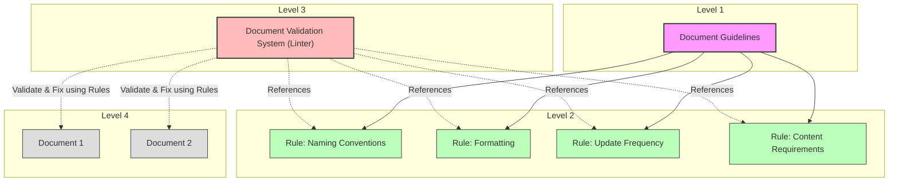
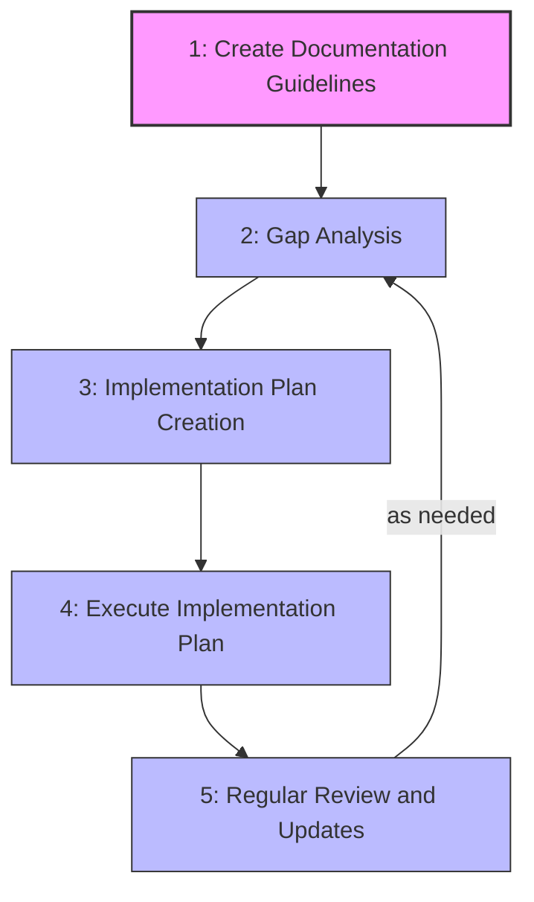

# Documentation System for People and LLMs to Work Together

## Document Management Conceptual Model

This documentation system is built around a simplified conceptual model inspired by software engineering practices, particularly ESLint and similar linting tools. The model consists of three key components that work together to ensure high-quality documentation.



### Key Components

1. **Document Guidelines** (Level 1)
   - Defines the fundamental purpose, values, and long-term vision for document management
   - Answers "why" and "for what purpose" documents are managed
   - Example: "All documentation must be maintained in a format understandable by both humans and LLMs, kept up-to-date, and allow quick access to necessary information"

2. **Document Rules** (Level 2)
   - Specific, verifiable individual rules derived from guidelines
   - Clear criteria for naming conventions, formatting, update frequency, etc.
   - Example: "All markdown files must include an update date at the top and contain a table of contents"

3. **Document Validation System (Linter)** (Level 3)
   - Mechanism to check rule compliance and enforce rules when necessary
   - Utilizes LLMs for intelligent validation and automated fixes
   - Example: A "Document Linter" checks all markdown files before commit and reports or automatically fixes rule violations

### Relationship to Software Engineering Practices

This conceptual model parallels common software engineering tools and practices:

1. **Document Guidelines** ≈ Architecture principles/design philosophy
2. **Document Rules** ≈ Coding conventions/ESLint rules
3. **Document Validation System** ≈ ESLint (with `--check` and `--fix` functionality)

Just as ESLint enforces code quality through defined rules and automated checking/fixing, our Document Validation System ensures documentation quality through similar mechanisms, leveraging LLMs for more intelligent and context-aware validation.

## STEP FLOW

The documentation system usage flow consists of the following 5 steps:

<details>
<summary>1. <b>Create Documentation Guidelines</b>: Define the ideal state declaratively.</summary>

- Understanding best practices
- Understanding current project characteristics
- Creating documentation guidelines
- Reviewing existing guidelines for improvement
</details>

<details>
<summary>2. <b>Gap Analysis</b>: Analyze the gap between the established guidelines and the current state.</summary>

- Understanding the documentation guidelines
- Understanding the current project state
- Analyzing the gaps between them
</details>

<details>
<summary>3. <b>Implementation Plan Creation</b>: Plan the steps to fill the identified gaps.</summary>

- Understanding the gaps
- Planning improvement steps
- Prioritizing and implementing in stages
</details>

<details>
<summary>4. <b>Execute Implementation Plan</b>: Implement improvements based on the plan.</summary>

- Understanding the implementation plan
- Understanding the current project state
- Executing improvements
</details>

<details>
<summary>5. <b>Regular Review and Updates</b>: Update or reapply guidelines according to project changes.</summary>

- Understanding current guidelines
- Improving and adjusting guidelines
- Repeating from step 2 as needed
</details>



## How to Use

Use the following commands with Cline or Roo Code:

```bash
# Step 1: Create Documentation Guidelines
@https://raw.githubusercontent.com/ToyB0x/ai-coding-rules/refs/heads/main/Guideline.md Create documentation guidelines following Step 1

# Step 2: Gap Analysis
@https://raw.githubusercontent.com/ToyB0x/ai-coding-rules/refs/heads/main/Guideline.md Perform gap analysis between current state and guidelines following Step 2

# Step 3: Implementation Plan
@https://raw.githubusercontent.com/ToyB0x/ai-coding-rules/refs/heads/main/Guideline.md Create an implementation plan for documentation guidelines following Step 3

# Step 4: Execute Implementation Plan
@https://raw.githubusercontent.com/ToyB0x/ai-coding-rules/refs/heads/main/Guideline.md Execute the implementation plan following Step 4

# Step 5: Regular Review and Updates
@https://raw.githubusercontent.com/ToyB0x/ai-coding-rules/refs/heads/main/Guideline.md Perform regular review and updates of documentation guidelines following Step 5
```

## Notes

### Considerations on Using Memory Bank

<details>
<summary>Show/Hide Details</summary>

- Memory Bank consumes tokens, so its usage should be evaluated based on project requirements
- Regardless of Memory Bank usage, large document collections can exceed 100k tokens, making incremental access important
- Personal observations on Memory Bank files:
  - activeContext.md: Regular conversation context may be sufficient
  - decisionLog.md: Team decisions should be properly committed to repositories
  - productContext.md: Product overviews should be committed with human consensus rather than auto-generated
  - progress.md: Team progress should be documented in organized repositories
  - systemPatterns.md: System structures should be documented in organized repositories
- Semi-automated reflection documents might be useful when accumulated insights can be committed to system interactions
  - A potentially better approach: include response history in LLM commits and use CI to automatically generate weekly retrospectives and improvement PRs
</details>
