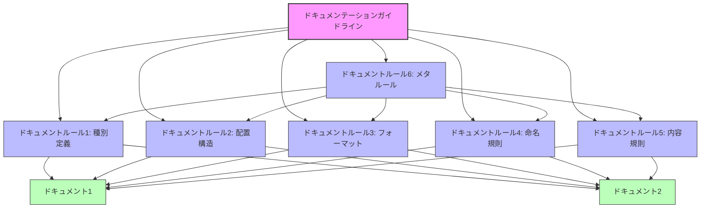

# Documentation system for people and LLMs to work together

## 目的

人とLLMの両方が効率的にプロジェクトを理解し効率的に協働するために、
- どういったテキスト資料や画像資料(以下では「ドキュメント」と呼称)が必要かを提案する
- 効果的にドキュメントを作成・更新、管理するためのガイドラインとプロセスを提案する

## 前提や背景

- 人もLLMもContextサイズの制約があるため必要なドキュメントに効率的にアクセスできるドキュメントを分割・整理する必要がある
- LLMは人間を超えた認識能力を持っているかもしれないが、人間との協働が必要な場合は、人間が理解できるようにドキュメントを作成・更新する必要がある

## 用語

- AI: CLINE やRoo Code などのAI, LLMツールを指す
- ドキュメント: テキスト資料や画像資料を指す。プログラムコードもある種のドキュメントとみなす。
- ドキュメンテーションガイドライン:
  - ドキュメントを作成・更新するためのガイドラインを指す。
  - 必要なドキュメント種別、理想的のドキュメントの配置構造や内容、フォーマット、命名規則などを含む。
  - 各プロジェクトは、プロジェクトの目的や規模に応じて、必要なドキュメンテーションガイドラインを独自に策定する必要がある。
- ドキュメントルール:
  - ドキュメントを作成・更新・管理するためのルールを指す。
  - ドキュメンテーションガイドラインは複数のドキュメントルールから構成される。
  - ドキュメンテーションガイドラインはプロジェクトの目的や規模に応じて独自に策定する必要があるが、ドキュメントルールはプロジェクトの目的や規模に関わらず、一般的に適用可能なルールを指す。
  - ドキュメントルールは複数存在し例えば以下のものがありえる
    - 作成が必要なドキュメント種別を扱うもの
    - ドキュメント配備構造を扱うもの
    - ドキュメントフォーマットを扱うもの
    - ドキュメントの命名規則を扱うもの
    - ドキュメントの内容を扱うもの
    - ドキュメントルールを扱うメタ的なドキュメントルール(ドキュメントルール自体が、ある種のドキュメントである)



## 利用フロー

1. ドキュメンテーションガイドラインの策定: あるべき理想状態を宣言的に定義する。以下のサブプロセスが含まれる
  - 本資料等を含むベストプラクティクスの理解
  - 現状の自プロジェクトの理解(特にプロジェクトの目的に応じた特性の理解。小規模プロジェクトと大規模プロジェクトでは必要なドキュメントが異なる)
  - 上記の理解を元に、ドキュメンテーションガイドラインを策定する。多くの場合はドキュメント構造やディレクトリ構造の定義、各種規約やガイドラインの定義を含む。
  - 既にドキュメンテーションガイドラインを策定している場合は、現状のガイドラインの改善が必要かを確認する

2. 現状とのギャップ分析: 上記で策定したドキュメンテーションガイドラインと現状のギャップを分析する。以下のサブプロセスが含まれる
  - 上記で定義したドキュメンテーションガイドラインの把握
  - 現状の自プロジェクトの理解
  - 両者のギャップの分析

3. ドキュメンテーションガイドラインの適用計画の策定: 上記で分析したギャップをどのような手順で埋めるのかを計画する。以下のサブプロセスが含まれる
  - 上記で分析したギャップの理解
  - それぞれのギャップをどのような手順で埋めるのかを計画する
  - 全てのギャップを一度に埋めることは難しいので、優先度をつけて、段階的に埋めることが望ましい。例えばドキュメンテーションガイドラインに含まれる多数のドキュメントルールのうち、適用しやすいものから適用していくなど

4. ドキュメンテーションガイドラインの適用計画の実行: 上記で策定した計画に基づいて改善を実行する。以下のサブプロセスが含まれる。
  - 上記で策定したドキュメンテーションガイドラインの適用計画の理解
  - 現状プロジェクトの理解(計画作成時と現状にズレがある場合に重要)
  - 適用計画に基づいて改善を実行する(計画作成時と現状にズレがある場合、前段階のフローからやり直すことを検討)

5. 定期的な検査と更新: プロジェクトの変化に合わせてドキュメンテーションガイドラインの更新、または再適用を行う。このプロセスは定期的に実施することが望ましい。以下のサブプロセスが含まれる
  - 現状のドキュメンテーションガイドラインの把握
  - ドキュメンテーションガイドラインの改善や調整を適宜行う (特にプロダクトの目的や機能に大きな変化が発生していないか確認を行う)
  - 上記 2. 以降のステップを繰り返す (時間経過により、策定されたガイドラインが遵守されていない状況が発生するので修正する)

## 利用方法

Cline または Roo Code に以下を指示して下さい

```bash
# Step1: ドキュメンテーションガイドラインの策定
@https://raw.githubusercontent.com/ToyB0x/ai-coding-rules/refs/heads/main/Guideline.md の内容を参考に Step1 のドキュメンテーションガイドラインを策定して

# Step2: 現状とのギャップ分析
@https://raw.githubusercontent.com/ToyB0x/ai-coding-rules/refs/heads/main/Guideline.md の内容を参考に Step2 のドキュメンテーションガイドラインの現状とのギャップ分析を行って

# Step3: ドキュメンテーションガイドラインの適用計画の策定
@https://raw.githubusercontent.com/ToyB0x/ai-coding-rules/refs/heads/main/Guideline.md の内容を参考に Step3 のドキュメンテーションガイドラインの適用計画を策定して

# Step4: ドキュメンテーションガイドラインの適用計画の実行
@https://raw.githubusercontent.com/ToyB0x/ai-coding-rules/refs/heads/main/Guideline.md の内容を参考に Step4 のドキュメンテーションガイドラインの適用計画を実行して

# Step5: 定期的な検査と更新
@https://raw.githubusercontent.com/ToyB0x/ai-coding-rules/refs/heads/main/Guideline.md の内容を参考に Step5 のドキュメンテーションガイドラインの定期的な検査と更新を行って
```

## Memo

### Memory Bank を利用すべきかどうか

- Memory Bank自体もトークンを消費するので、Memory Bankを利用するかどうかはプロジェクトの状況に応じて判断が必要そう。
- Memory Bank自体の利用有無に関わらず、大規模なドキュメント群だと、全部読み込ませると10 万トークンを超えることがあるので、段階的にアクセスできることが大切である(Memory Bankはこれを半自動でやってくれるだけ)
- 私個人は以下が疑問だったので試しはしたが、あまり積極的には利用していない
  - activeContext.md    普通に会話のContextで良いのでは
  - decisionLog.md      個人で使う分には会話のContextで良いし、人も理解すべきチームの判断は整理された場所にCommitすべき
  - productContext.md   人もLLMもプロダクトの概要を理解するために、普通にCommitすべきでは(半分使い捨て、自動生成に頼るよりも、しっかり人間合意のもとで作るべきでは)
  - progress.md         個人で使う分には会話のContextで良いし、人も理解すべきチームの進捗は整理された場所にCommitすべき
  - systemPatterns.md   個人で使う分には会話のContextで良いし、人も理解すべき構造は整理された場所にCommitすべき
- 一方で振り返りと改善.md みたいなもので個人レベルの振り返りを半自動でためておき、ある程度のまとまりで知見がたまったらsystem interactionにコミットするのは良いかもしれない(改善の自動化)
  - ただ、これもLLMによる commit に commit の応答Historyを含ませた上で、週次でCIで commit 履歴から自動で振り返りさせて、提案PRを自動で作るとかの方が個人的には良い気がする
